<p align="center">
  <picture>
    <source media="(prefers-color-scheme: dark)" srcset="kit/files/www/flint/logo.svg">
    
  </picture>
</p>

<h1 align="center">Flint VPN</h1>

<p align="center">
  <b>Transparent VPN (Xray, VLESS + REALITY) for your whole home network on a GL.iNet router, with a web control panel.</b><br>
  <i>Your network. Your rules.</i>
</p>

<p align="center">
  <a href="README.md">Русский</a> ·
  <a href="#quick-start">Quick start</a> ·
  <a href="#web-panel">Web panel</a> ·
  <a href="#troubleshooting">Troubleshooting</a> ·
  <a href="CHANGELOG.en.md">Changelog</a> ·
  <a href="LICENSE.en.md">License</a>
</p>

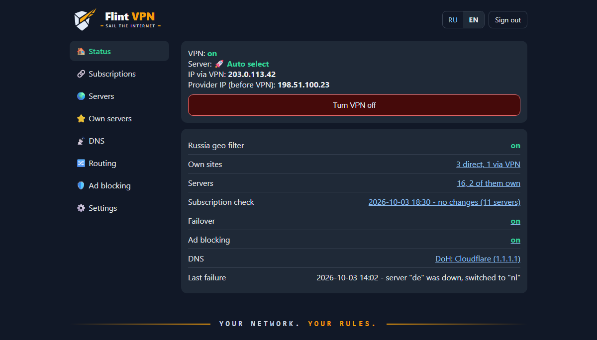

## About

Flint VPN turns a GL.iNet router into a transparent VPN gateway. Every device on its Wi‑Fi or LAN — phones, laptops, TVs, consoles — goes online through Xray (VLESS + REALITY) with no settings or apps on the devices themselves. Russian sites can optionally go direct.

> [!NOTE]
> **Tested on GL.iNet GL-BE6500 (Flint 3e)**, GL firmware 4.x (OpenWrt 23.05), Repeater mode (the router connects to the main home router over Wi‑Fi).
>
> This build was made for personal use, for my own router. It should work on other OpenWrt devices too (aarch64 first of all), but it has not been tested there — see [Other OpenWrt routers](#other-openwrt-routers).

**Why a custom web panel.** The ready-made solution from GitHub I was using simply refused to start on this router. So the Xray setup, server switching and everything else are done here from scratch: a set of shell scripts and a lightweight CGI panel running on the stock `uhttpd`, with no Node.js, Python or other heavy dependencies on the router.

The panel is available in English and Russian: the language follows your browser, and there is an RU | EN switch in the top right corner.

## Features

- **Transparent VPN for the whole network.** Client TCP traffic is redirected into Xray; nothing to configure on devices.
- **Russia geo filter.** Russian sites (`geosite:category-ru`) and IPs (`geoip:ru`) go direct, the rest via VPN. One button turns it off (everything via VPN).
- **Your own rules.** Sites, IPs and subnets "always direct" or "always via VPN", taking priority over the geo filter.
- **Web panel** at `http://vpn.lan:81/`, protected by a PIN: server selection, VPN on/off, routing, own servers. Works on phones.
- **Subscriptions from any providers.** Add several subscriptions in the v2rayN / Happ / Hiddify format — servers from all of them show up in the panel, grouped by provider. The subscription name, expiry date and traffic are picked up automatically. The list is refreshed on demand or automatically (every 30 minutes to once a day); the router downloads subscriptions directly, so refreshing works even when the current server is down.
- **Own servers.** Add by `vless://` link, by copying a subscription server, or manually; TCP (xtls-rprx-vision) or gRPC transport.
- **Failover.** Every 2 minutes the router checks the tunnel; if the server stopped responding while the internet is up, it refreshes the subscription and switches to the first working server.
- **White lists.** Provider servers given by bare IP (for networks where only a white list is open) are grouped in a separate collapsible block.
- **DNS over HTTPS** (dnscrypt-proxy) against DNS spoofing; client DNS queries are forced through the router.
- **Ad blocking** for the whole network at the DNS level — AdGuard Home from the GL firmware, one button to turn it on. The default list is AdGuard DNS filter, the DNS version of the filters in paid AdGuard; add your own lists by URL and your own rules. Lists update by themselves, and individual devices and sites can be excluded.
- **Home network access.** The main router's LAN, NAS and printer are reachable directly, bypassing the VPN; local names (`nas01`) are served by dnsmasq.
- **Backup and restore** with one command; redeploying keeps the settings made in the panel.

## Screenshots

| Login | Status |
|---|---|
| 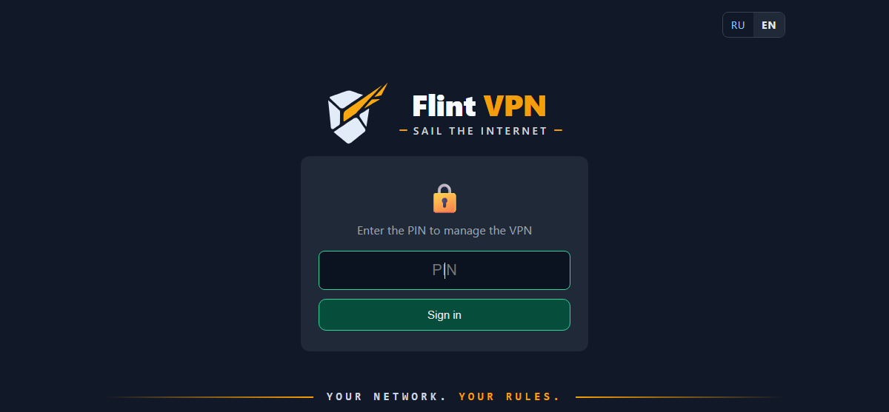 |  |
| **Servers** | **White lists** |
| 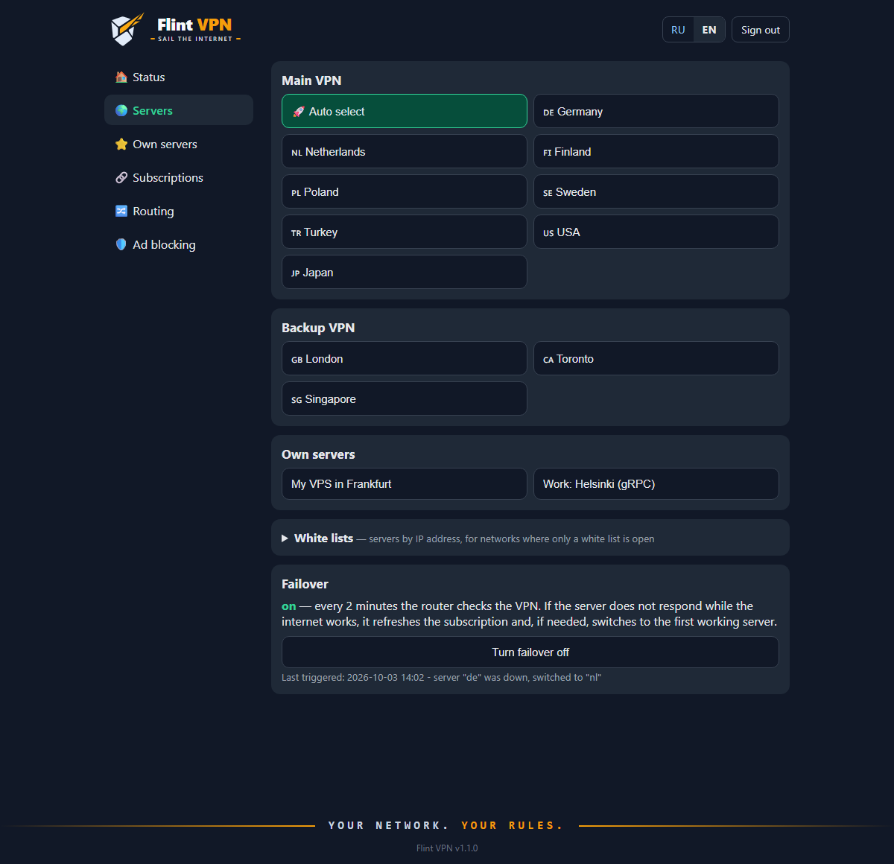 | 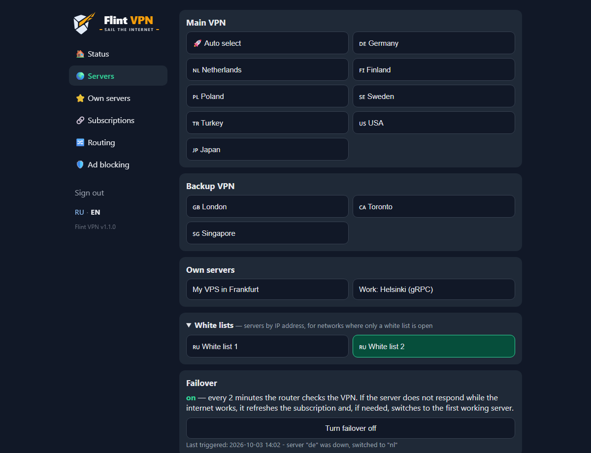 |
| **Own servers** | **Editing a server** |
| 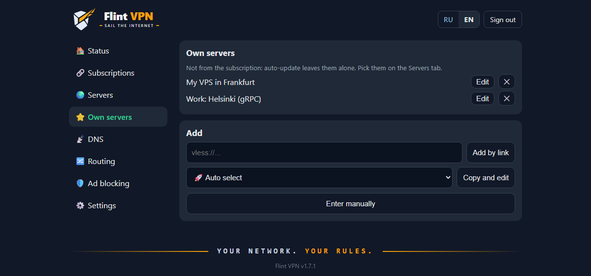 | 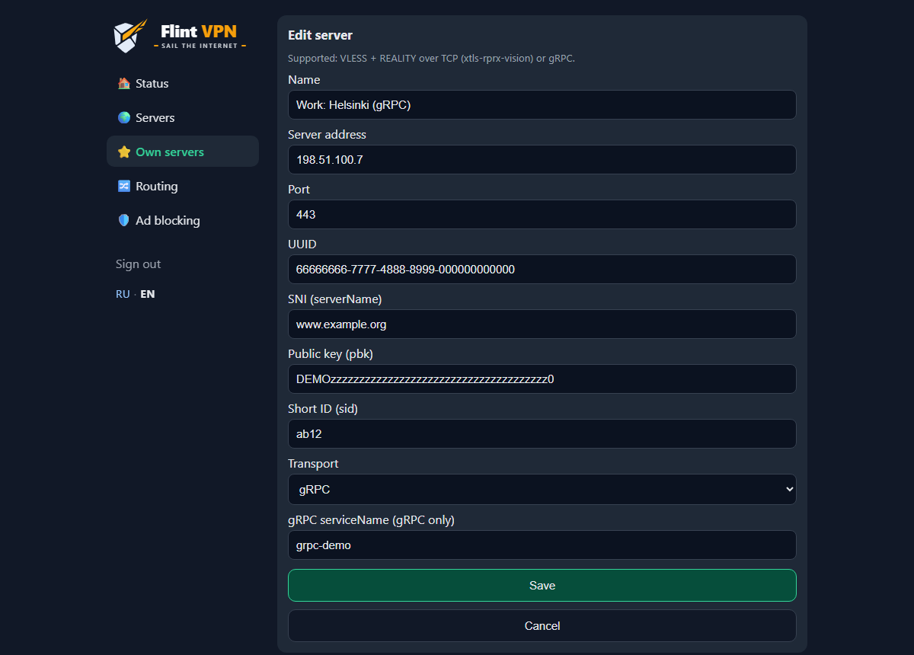 |
| **Subscriptions** | **Routing** |
| 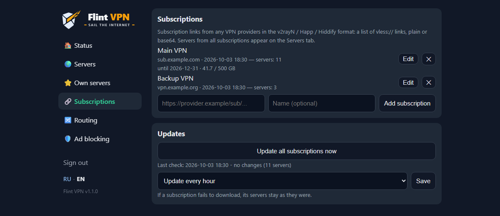 | 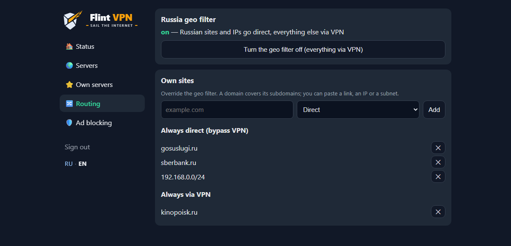 |
| **Ad blocking** | **Phone** |
| 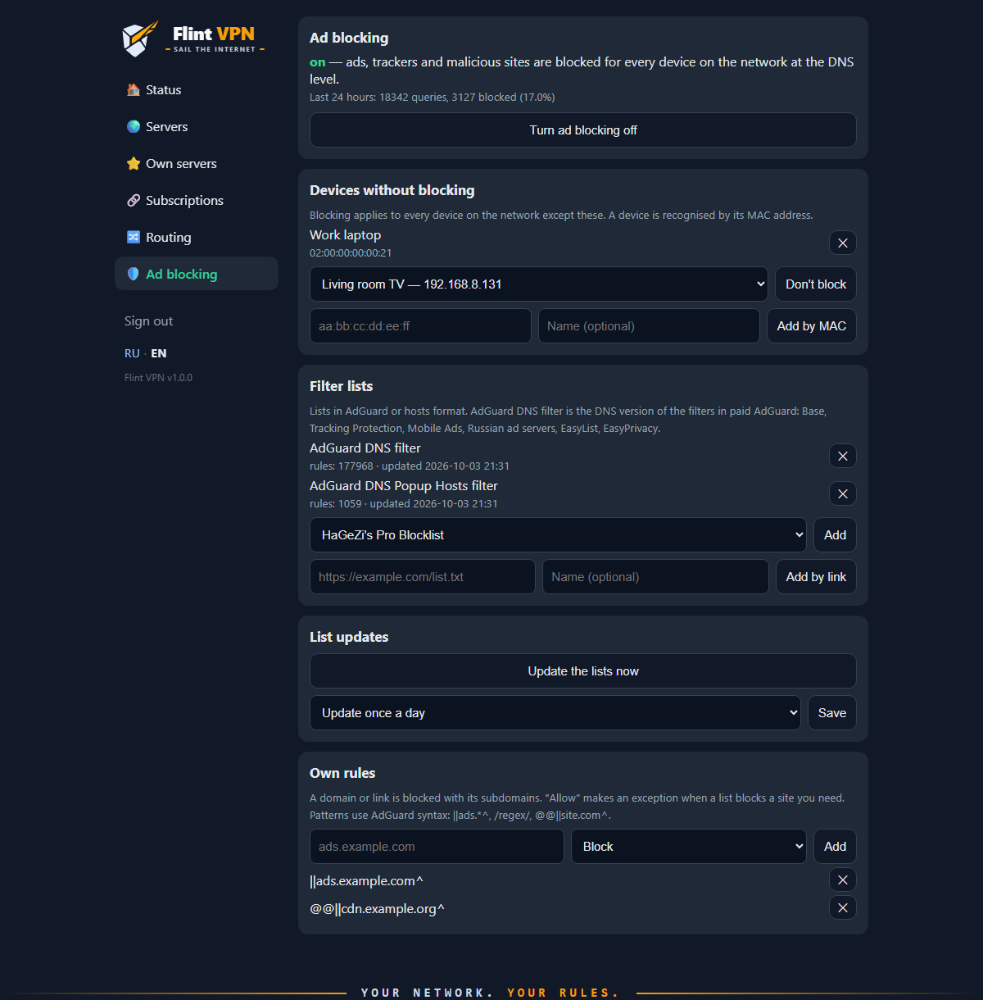 | 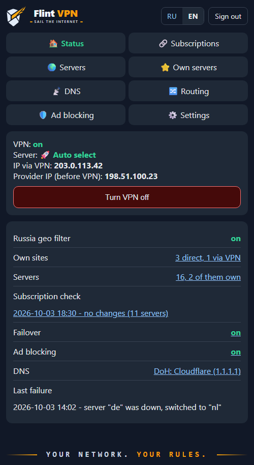 |
| **Phone: servers** | **No servers** |
| 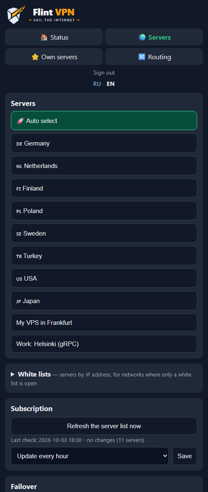 | 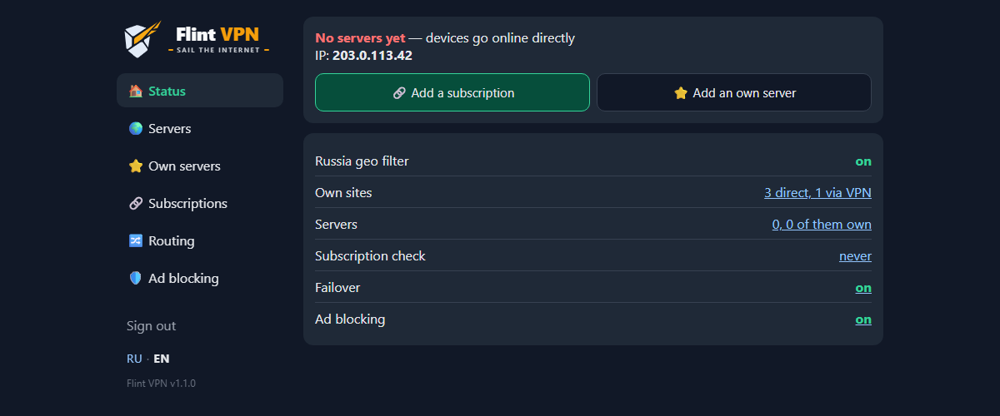 |

The screenshots use demo data: documentation IP ranges, made-up servers and keys.

## How it works

```
 Phone / laptop / TV
          │  Wi-Fi or LAN, no settings
          ▼
 ┌──────────────── Flint (OpenWrt) ────────────────┐
 │ DNS: [AdGuard Home] ──► dnsmasq ──► DoH         │
 │ iptables: TCP from br-lan ──► Xray :12345       │
 │ Xray: RU and own "direct" ──► direct            │
 │       everything else ──► VLESS + REALITY       │
 │ uhttpd :81 ──► web panel (CGI)                  │
 └─────────────────────────────────────────────────┘
          │
          ▼
 Main router ──► internet
```

- `iptables` rules (in `/etc/firewall.user`) send client TCP traffic from `br-lan` into Xray's `dokodemo-door`. Local and private networks and the VPN servers' own addresses bypass it.
- Client DNS queries are forced to the router. With ad blocking on they go to AdGuard Home first, otherwise straight to dnsmasq; then to dnscrypt-proxy (DoH).
- QUIC (UDP 443) is blocked so that browsers and apps fall back to TCP and enter the tunnel. Other UDP goes direct.
- The Xray config is rendered from `/etc/xray/template.json` by `flint-node`: selected server, geo filter, own sites. It is validated with `xray -test` before being applied, and the exit IP is checked afterwards.
- The router's own traffic (subscription and package updates) goes direct.

## Requirements

**Router**
- GL.iNet with firmware 4.x (OpenWrt 22.03+ with fw4) or another OpenWrt router — see [below](#other-openwrt-routers);
- **aarch64** architecture (the installer checks it);
- internet access during installation (packages come from `opkg`) and ~60 MB of free space: Xray is about 27 MB, the geoip/geosite databases about 25 MB;
- SSH access as `root` (enabled by default on GL.iNet; the password is the admin panel one).

**VPN**
- a provider subscription with `vless://` links (VLESS + REALITY), as used by Happ, v2rayN or Hiddify, or your own VLESS + REALITY server.

**Computer for installation**
- Windows 10/11 with PowerShell and the built-in OpenSSH, **or** macOS / Linux with `ssh` and `tar`.

## Quick start

### 1. Get the project

```sh
git clone https://github.com/AndreyTokarev/Flint_Vless.git
cd Flint_Vless
```

Or download a ZIP: green **Code → Download ZIP** button on GitHub, then unpack it.

### 2. Prepare the router

1. Open the GL.iNet admin panel at `http://192.168.8.1` and set the admin password.
2. Connect the router to the internet. Tested in **Repeater** mode: *Internet → Repeater* → pick your main router's Wi‑Fi. A cable in WAN works too — then set `UPSTREAM_IF=wan` below.
3. Make sure the internet works on the router (green connection status in the admin panel).
4. If the router was reset and you have connected to it over SSH before, remove the old host key:
   ```sh
   ssh-keygen -R 192.168.8.1
   ```

### 3. Add an SSH key (recommended)

Without a key you will type the `root` password several times per deploy.

```powershell
# Windows (PowerShell). No key yet? ssh-keygen -t ed25519
Get-Content "$HOME\.ssh\id_ed25519.pub" | ssh root@192.168.8.1 "cat >> /etc/dropbear/authorized_keys && chmod 600 /etc/dropbear/authorized_keys"
```

```sh
# macOS / Linux
cat ~/.ssh/id_*.pub | ssh root@192.168.8.1 "cat >> /etc/dropbear/authorized_keys && chmod 600 /etc/dropbear/authorized_keys"
```

Check: `ssh root@192.168.8.1 echo ok` should print `ok` without asking for a password.

### 4. Fill in `config/flint.env`

```powershell
Copy-Item config\flint.env.example config\flint.env     # Windows
```
```sh
cp config/flint.env.example config/flint.env              # macOS / Linux
```

The minimum to fill in:

| Setting | Value |
|---|---|
| `UI_PIN` | panel PIN (letters and digits) |
| `SUB_URL` | subscription URL (the one you add to Happ / v2rayN). May be left empty: add the subscription later in the panel |
| `UPSTREAM_IF` | `sta1` — router on Wi‑Fi (Repeater), `wan` — on a cable |
| `UPSTREAM_NET` | main router's network, e.g. `192.168.0.0/24` or `192.168.1.0/24` |

All settings are described in [Settings](#settings-configflintenv). `config/flint.env` is never committed.

### 5. Set servers manually in `config/nodes.conf` (optional)

Usually not needed. If `SUB_URL` is set, the router downloads the subscription's servers during the install and keeps the list fresh by itself. The install also works without servers: devices go online directly until you add a subscription on the Subscriptions tab (or an own server on the Own servers tab), then the VPN turns on by itself.

With no subscription, only a server link, copy `config/nodes.conf.example` to `config/nodes.conf` and add the server from the link (or add it after the install on the Own servers tab):

```
vless://UUID@ADDRESS:PORT?type=tcp&security=reality&sni=SNI&pbk=PBK&sid=SID&flow=xtls-rprx-vision#NAME
```

```
# 🇳🇱 Netherlands
nl  ADDRESS  SNI  PBK  SID  UUID  PORT
```

The comment line above a server is its name in the panel. An empty `sid` is written as `-`. The first field is a short code (`nl`); after the install the server with the `DEFAULT_NODE` code from `flint.env` is enabled, or the first one if there is no such code.

### 6. Install

From the project root:

```powershell
.\deploy.ps1                       # Windows
.\deploy.ps1 -Router 192.168.8.1   # if the router has another address
```
```sh
./deploy.sh                        # macOS / Linux
./deploy.sh 192.168.8.1
```

> [!TIP]
> If PowerShell says running scripts is disabled, allow it for the current window:
> `Set-ExecutionPolicy -Scope Process Bypass`

The script packs the kit, uploads it and runs `install.sh` on the router. It takes a few minutes: packages are installed, Xray and the geoip/geosite databases (~25 MB) are downloaded. At the end you will see:

```
DNS: ok
VPN exit IP: 203.0.113.42
Panel: http://vpn.lan:81/  (PIN from flint.env)
```

`VPN exit IP` is the VPN server's address, not your home one. If you get `VPN: FAIL` instead, see [Troubleshooting](#troubleshooting).

### 7. Open the panel

Connect to the router's Wi‑Fi and open **http://vpn.lan:81/** (or `http://192.168.8.1:81/`), enter the PIN from `flint.env`. To check the VPN, open any site like [ifconfig.me](https://ifconfig.me): it should show the VPN server's address.

You can rerun the installation any number of times — for example after changing `flint.env` or updating the project. Settings made in the panel (own servers, sites, update interval) are kept.

## Web panel

Address: **http://vpn.lan:81/** (port 80 is taken by the stock GL.iNet admin panel). The panel is reachable only from the router's LAN and from the main router's network (`UPSTREAM_NET`).

| Tab | What's there |
|---|---|
| **Status** | VPN on/off button, current server, exit IP, geo filter, number of own sites and servers, last subscription check, failover state and last failure, ad blocking |
| **Servers** | one-click server selection — servers grouped by subscription, own servers apart; "White lists" block; failover on/off |
| **Own servers** | servers not from the subscription: add by `vless://` link, copy a subscription server and edit the copy, enter manually; edit or delete |
| **Subscriptions** | VPN provider subscriptions: add by link, change the link or name, delete; last update, number of servers, expiry and traffic; "Update all subscriptions now" and the auto-update interval |
| **Routing** | Russia geo filter on/off; own sites, IPs and subnets "always direct" or "always via VPN" |
| **Ad blocking** | ad blocking on/off and 24-hour stats; devices without blocking; sites without blocking and "Recently blocked" with an Allow button; filter lists — ready-made and your own by URL; auto-update and "Update the lists now"; own rules |

The panel speaks English and Russian. On the first visit the language follows the browser (or `UI_LANG` in `flint.env`); after that use the **RU | EN** switch in the top right corner (next to "Sign out"; on the login page too) — the choice is remembered in the browser. Messages after panel actions use the same language.

## Settings `config/flint.env`

| Setting | Description |
|---|---|
| `VLESS_UUID` | optional: UUID for `config/nodes.conf` lines without one (subscription and own servers carry their own) |
| `UI_PIN` | panel PIN (letters and digits only) |
| `UI_TITLE` | text of the panel logo, default `Flint VPN` (the last word is gold) |
| `UI_TAGLINE` | tagline under the logo, default `Sail the internet`; an empty value removes it |
| `UI_LANG` | default panel language: `ru` or `en`; empty — follow the browser. Background records (last subscription check, last failure) are written in it too |
| `DEFAULT_NODE` | server code enabled after installation (usually `auto`); the first server if there is no such code |
| `ROUTING` | `ru` — Russian sites and IPs direct, the rest via VPN; `global` — everything via VPN. The `geoip.dat`/`geosite.dat` databases (Loyalsoldier) are downloaded on install and updated on Sundays at 4:30; without them the router runs in `global` mode |
| `UPSTREAM_IF` | main router interface: `sta1` (Wi‑Fi, Repeater) or `wan` (cable) |
| `UPSTREAM_NET` | main router's network; reachable from devices behind Flint without the VPN, and Flint is reachable from it |
| `LOCAL_HOSTS` | local names: `"nas01=192.168.0.145 printer=192.168.0.50"` — `nas01`, `nas01.lan`, `nas01.local` will resolve |
| `SUB_URL` | optional: the first subscription on a fresh router; more are added on the Subscriptions tab (see [Subscriptions](#subscriptions)) |
| `SUB_INTERVAL` | auto-update interval for a fresh router: `off`, `30m`, `1h`, `3h`, `6h`, `12h`, `24h` (default `24h`); later changed in the panel, survives redeploys |
| `SUB_GRPC` | `1` — also import gRPC servers from the subscription (skipped by default, see [Limitations](#limitations)) |
| `ADBLOCK` | `on` — turn ad blocking on for a fresh router; later it is switched in the panel, and the choice survives redeploys |
| `XRAY_VERSION` | Xray release downloaded from GitHub if `xray-core` is not available in `opkg` (default `v1.8.24`) |

## Servers `config/nodes.conf`

The router builds subscription servers by itself (`flint-sub-update`, see [Subscriptions](#subscriptions)). `config/nodes.conf` holds only manually set servers; when the file exists, a deploy uploads it to the router, otherwise the router keeps its copy. From subscriptions VLESS + REALITY over TCP (xtls-rprx-vision) is imported, including bare-IP servers, which go to the "white lists" block. gRPC only with `SUB_GRPC=1`. Provider announcements disguised as servers (names starting with ❗) are skipped.

Line format:

```
code  address  sni  pbk  sid  [uuid]  [port]  [tcp|grpc]  [serviceName]
```

An empty field is `-`; `uuid` defaults to `VLESS_UUID`, port to `443`, transport to `tcp`. The comment line above a server is its panel name.

**Own servers** added in the panel are stored separately on the router, in `/etc/xray/nodes-custom.conf`, with codes `my1`, `my2`… Subscription updates don't touch them.

## Subscriptions

You can have several subscriptions from different providers: add, change and delete them on the Subscriptions tab or with `flint-sub-update`. A regular subscription link from Happ, v2rayN or Hiddify works — a list of `vless://` links (plain or base64). On the first run `SUB_URL` from `flint.env` becomes the first subscription.

- A subscription is added only if it downloads and has supported servers (VLESS + REALITY).
- Each subscription's servers live in `/etc/xray/nodes.d/<id>.conf`, own servers in `nodes-custom.conf`, manual ones in `nodes.conf`. When codes clash, the second server gets a number: `de`, `de2`.
- If a subscription fails to download during an update, its servers stay as they were and the panel shows the error.
- The default subscription name comes from the `profile-title` header, the expiry and traffic from `subscription-userinfo` (most providers send them for Happ).
- The hosts of all subscriptions bypass the VPN, so refreshing works even when the current server is down.
- The list lives in `/etc/xray/subscriptions` (links carry a token, keep it secret); a backup copies it to `config/subscriptions`.
- There may be no subscriptions at all, e.g. right after an install without `SUB_URL` or after deleting the last one. With no own servers either, Xray stays down and devices go online directly; the Status tab shows it. The first subscription or own server added turns the VPN on by itself.

## Failover

`flint-watchdog` runs from cron every 2 minutes: it checks the tunnel (a request to `generate_204` through Xray); on failure it waits 10 seconds and checks again; if the direct internet works (so it's the server, not the ISP), it refreshes the subscription; if the current server still fails, it tries the others in order and stays on the first working one, or returns to the original if none works. The last result is shown in the panel and in `/etc/xray/watchdog-last`. Turn it off in the panel or with `flint-watchdog off`.

## Ad blocking

Works at the DNS level for every device on the network, with no apps on the devices. It uses AdGuard Home, which already ships with GL.iNet firmware 4.x (`/usr/bin/AdGuardHome`): the project runs its own instance on `127.0.0.1:5054`. The stock AdGuard Home from the GL admin panel stays off — don't turn both on.

How it works:
- with blocking on, the firewall (`FLINT_DNS` chain) sends client DNS queries to AdGuard Home, which forwards them to dnsmasq, so local names and DoH keep working;
- devices in "Devices without blocking" (by MAC address) go straight to dnsmasq;
- every 2 minutes cron checks that AdGuard Home answers. If not, it restarts it, and if that fails, DNS bypasses it until it is back. The ad blocker never takes the internet down;
- the AdGuard Home web UI is not exposed (`127.0.0.1` only); everything is managed from the panel.

**Lists.** The default is [AdGuard DNS filter](https://github.com/AdguardTeam/AdGuardSDNSFilter): the DNS version of the filters in paid AdGuard products (Base, Tracking Protection, Mobile Ads, Russian and other regional ad servers, EasyList, EasyPrivacy). It is free and open. The panel adds ready-made lists from the [AdGuard registry](https://github.com/AdguardTeam/HostlistsRegistry) (Popup Hosts, HaGeZi Pro, OISD, Steven Black, phishing and malware protection) or any list by URL in AdGuard/Adblock or hosts format. More lists mean more false positives, so start with one.

**Updates.** Lists update automatically — once a day by default, from every hour to once a week, or off — and with the "Update the lists now" button.

**Own rules:**

| What you enter | Result |
|---|---|
| `ads.example.com` or a link, "Block" | the domain is blocked with its subdomains (`\|\|ads.example.com^`) |
| the same, "Allow" | an exception (`@@\|\|ads.example.com^`) when a list blocks a site you need |
| `\|\|ads.*^`, `/^ad[0-9]+\./`, `@@\|\|site.com^` | a rule in [AdGuard syntax](https://adguard-dns.io/kb/general/dns-filtering-syntax/) as is |

Rules take effect in a few seconds.

AdGuard Home uses 40–60 MB of RAM; with blocking off it is stopped.

### Where ads remain

DNS blocking sees only the names of the sites a device connects to, not the page content. Hence the limits:

- **Ads from the same domain as the content stay.** VK (ad blocks in the feed and the left column), YouTube (pre-roll and mid-roll ads), Instagram, Facebook, Yandex search and Dzen serve ads from their own servers together with the feed, and the ad images come from the same hosts as post photos. DNS can block such ads only together with the site itself, so a "Block" rule for `vk.com` or `youtube.com` will not help — it just breaks the site.
- **Page elements are not hidden.** An empty frame or placeholder may stay where a blocked banner was.
- **In-app ads** (YouTube on a TV, social network apps on a phone) are removed only partly, for the same reason.

On such sites only a blocker on the device itself helps: the [uBlock Origin](https://ublockorigin.com/) extension in a desktop browser, Firefox with uBlock Origin on Android. It hides ad blocks right on the page and complements the router nicely: the router closes ad and tracker domains for every device, TVs and apps included, and the extension handles what comes from the site itself.

**Who bypasses the blocking.** Devices whose DNS queries skip the router:
- Android with Private DNS on;
- browsers with secure DNS (DoH): Chrome, Edge, Firefox, Yandex Browser;
- devices running a VPN client (Happ, v2rayN, Hiddify, etc.): DNS and all traffic go into its tunnel, so neither the blocking nor the router's VPN apply. Behind Flint a VPN client isn't needed — turn it off.

More on device settings in [Devices on the network](#devices-on-the-network). If a site you need broke after turning blocking on, allow its domain in "Own rules" or add the device to "Devices without blocking".

## Access from the main router's network

`install.sh` allows incoming connections from `UPSTREAM_NET` to Flint and to devices behind it (`192.168.8.x`). If the main router's network changes, update `UPSTREAM_IF` / `UPSTREAM_NET` in `config/flint.env` and redeploy. On the main router, add a DHCP reservation for Flint (e.g. `192.168.0.111`) and a static route: network `192.168.8.0`, mask `255.255.255.0`, gateway `192.168.0.111`.

## Backup

```powershell
.\backup.ps1               # router configs -> backup\<date>\router-config.tar.gz, refreshes config\
.\backup.ps1 -WithBinary   # plus backup\bin\xray (~27 MB) — useful if opkg is unavailable
```
```sh
./backup.sh
./backup.sh --with-binary
```

The backup pulls from the router its settings, the own servers and sites from the panel, and the network and Wi‑Fi configs. The user files listed in `kit/state-files` (`flint.env`, servers, subscriptions, sites, ad blocking files) are saved as one archive, `backup\<date>\state.tar.gz`, and also copied into `config/`, which the deploy uploads later.

> [!WARNING]
> `backup/` and the files in `config/` contain your subscription UUID and Wi‑Fi passwords. They are gitignored; keep them separately — in the cloud or on a USB stick.

## Restore from a backup

```powershell
.\restore.ps1                                   # latest backup\<date>
.\restore.ps1 -Backup backup\2026-10-03_1557    # a specific one
.\restore.ps1 -Full                             # plus network, Wi-Fi, firewall, DHCP, SSH keys and a reboot
```
```sh
./restore.sh
./restore.sh backup/2026-10-03_1557
./restore.sh --full
```

By default the settings from the backup (`flint.env`, servers, subscriptions, own servers and sites, ad blocking lists, rules and exclusions) go into `config/`, then a normal deploy runs. This works for a reset router too: first connect it to the internet in the GL admin panel. The current `config/` files are saved to `backup/config-before-restore-<time>/` before being replaced.

`-Full` / `--full` is only for the **same** router: it brings back its network, Wi‑Fi (SSIDs and passwords), firewall, DHCP reservations, cron and SSH keys, then reboots. The script asks for confirmation (`-Yes` / `--yes` skips it).

## Router commands

```sh
flint-node list                  # current server and codes
flint-node nl                    # switch to server nl (with an exit IP check)
flint-node routing ru            # geo filter: RU direct (global — everything via VPN)
flint-node vpn off               # clients go online directly (on — via VPN again)
flint-node site add direct example.ru     # own site: direct — bypass VPN, proxy — via VPN
flint-custom link 'vless://...'  # add an own server by link
flint-sub-update                 # update all subscriptions
flint-sub-update list            # subscriptions: id, name, host, last update, expiry and traffic
flint-sub-update add 'https://...' "Name"   # add a subscription
flint-sub-update set s2 'https://...'      # new link (or name) for subscription s2
flint-sub-update del s2          # delete a subscription and its servers
flint-sub-update interval 1h     # auto-update: off, 30m, 1h, 3h, 6h, 12h, 24h
flint-watchdog off               # turn failover off (on — turn on)
flint-geo-update                 # update geoip/geosite manually
flint-adblock on                 # ad blocking (off — turn off)
flint-adblock list               # lists: URL, name, rules, last update
flint-adblock list add https://example.com/list.txt "Name"
flint-adblock rule add block ads.example.com   # allow — exception
flint-adblock blocked                          # recently blocked domains and devices
flint-adblock exclude add aa:bb:cc:dd:ee:ff    # device without blocking
flint-adblock refresh            # update the lists now
flint-adblock interval 24        # auto-update: off, 1, 12, 24, 72, 168 hours
logread -e xray                # Xray logs
```

## Devices on the network

- Devices behind Flint don't need a VPN client. If one is on anyway (e.g. Happ), its connections to the provider's servers leave Flint directly rather than through a second VPN, but such a device bypasses the router's geo filter, own sites and ad blocking: the client decides everything.
- **Android:** *Settings → Network → Private DNS → Off*, otherwise the phone bypasses the router's DNS.
- **Windows:** in the Wi‑Fi properties set *DNS server assignment → Automatic (DHCP)*; otherwise DoH bypasses the router's DNS and local names (`nas01`) don't resolve.
- **Browsers** with secure DNS (DoH) also bypass the router's DNS — the geo filter and own sites by domain still work (Xray reads the domain from TLS), local names and ad blocking don't.

## Other OpenWrt routers

Built for and tested only on the GL-BE6500. It should work elsewhere if:

- the CPU is **aarch64** (the installer stops otherwise; for `armv7`/`mips` remove the check in `kit/install.sh` and provide Xray for your architecture);
- the firmware is **OpenWrt 22.03+ with fw4**; rules use `iptables` in `/etc/firewall.user`, the installer adds `iptables-nft` and `iptables-mod-nat-extra` when needed;
- the LAN bridge is **`br-lan`**; the LAN address is read from `uci`;
- `UPSTREAM_IF` names the uplink interface (`wan`, `sta1`, `wwan`…);
- **port 81** is free.

If you run it on another device, please report the result in [Issues](https://github.com/AndreyTokarev/Flint_Vless/issues).

## Troubleshooting

| Symptom | What to check |
|---|---|
| `VPN: FAIL` at the end of install | is the subscription alive (Subscriptions tab); is `VLESS_UUID` correct for manual `nodes.conf` lines; is `DEFAULT_NODE` alive (try another: `flint-node <code>`); `logread -e xray` |
| `DNS: FAIL` | `/etc/init.d/flint-doh restart`, then `nslookup youtube.com 127.0.0.1`; does the router have internet |
| Panel doesn't open at `vpn.lan` | use `http://192.168.8.1:81/`; disable Private DNS / DoH on the device; `/etc/init.d/flint-ui restart` |
| No internet after switching servers | the server is down — pick another or enable failover; as a last resort turn the VPN off on the Status tab |
| A server fails though it works in Happ | the provider rotated keys or SNI — "Subscriptions → Update all subscriptions now" |
| A subscription is not added | "could not be downloaded" - open the link in a browser, check the router's internet; "no supported servers" - the subscription has no VLESS + REALITY (VMess, Trojan, Shadowsocks, XHTTP are not supported) |
| A Russian site goes via VPN | geoip/geosite missing (then `global` mode): `flint-geo-update`; or add the site as "direct" |
| A site or app broke with ad blocking on | turn blocking off to confirm; if it is the cause, add the domain to own rules as "Allow" or the device to "Devices without blocking" |
| Ads are not blocked on a device | turn off Private DNS, browser DoH and any VPN client (Happ, etc.) on it; check it is not excluded |
| Ads remain on VK, YouTube, etc. | they come from the same domain as the content and DNS blocking can't remove them — install uBlock Origin in the browser (see [Where ads remain](#where-ads-remain)) |
| `opkg install ... failed` | `/tmp/flint-opkg.log`; router internet; put Xray into `backup/bin/xray` |

## Limitations

- **TCP only.** UDP 443 (QUIC) is blocked so browsers use TCP; other UDP goes direct.
- **IPv6 is not tunnelled.** If the main router hands out IPv6, disable it for the Flint network.
- **Xray 1.8.x from opkg:** no XHTTP transport; the gRPC "white list" servers of some providers fail the REALITY handshake with it, so they are not imported by default.
- **The panel is for the home network:** plain HTTP, the PIN travels in the request URL. Never expose port 81 to the internet.

## Versions

Versions follow [SemVer](https://semver.org): `1.2.3` is major (incompatible changes), minor (new features), patch (fixes). The number is in `kit/VERSION`, every version has a `vX.Y.Z` git tag, and the changes are in [CHANGELOG.en.md](CHANGELOG.en.md).

On the router the version is shown at the bottom of the panel menu and in `/usr/share/flint/version`; a deploy prints which version it installs and which one was there.

## Contributing

Pull requests and issues are welcome: fixes, support for other routers, panel translations. By submitting a pull request you agree to the terms in [LICENSE.en.md](LICENSE.en.md#contributions).

## Credits

[Xray-core](https://github.com/XTLS/Xray-core), [Loyalsoldier/v2ray-rules-dat](https://github.com/Loyalsoldier/v2ray-rules-dat), [dnscrypt-proxy](https://github.com/DNSCrypt/dnscrypt-proxy), [AdGuard Home](https://github.com/AdguardTeam/AdGuardHome) and [AdGuard filters](https://github.com/AdguardTeam/AdGuardSDNSFilter), [OpenWrt](https://openwrt.org), [GL.iNet](https://www.gl-inet.com).

## License

Free for personal and noncommercial use, with mandatory credit to the original project. Commercial use and use by government bodies and government-controlled companies require the author's permission. License text: [LICENSE](LICENSE) (Flint VPN Noncommercial License 1.0, based on PolyForm Noncommercial 1.0.0); summary and contribution terms: [LICENSE.en.md](LICENSE.en.md).

This project is not affiliated with GL.iNet or any VPN provider. Use it in accordance with the laws of your country.
