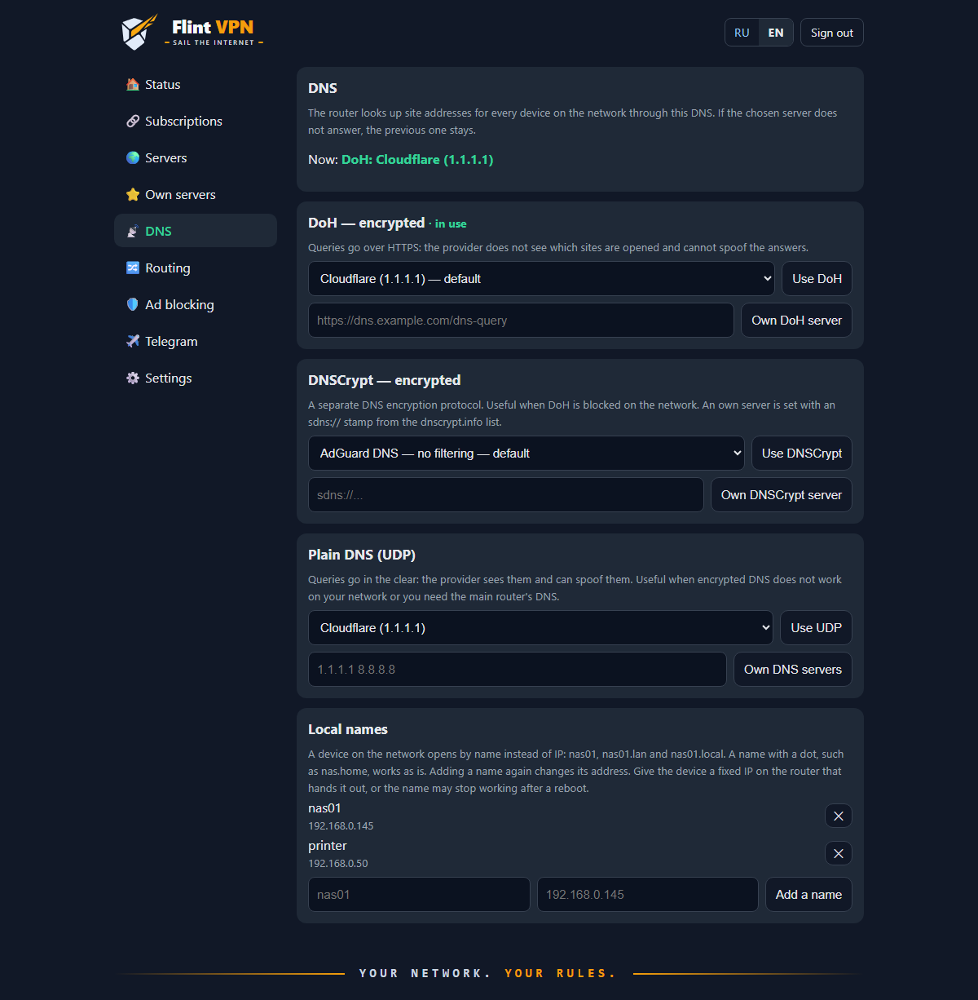
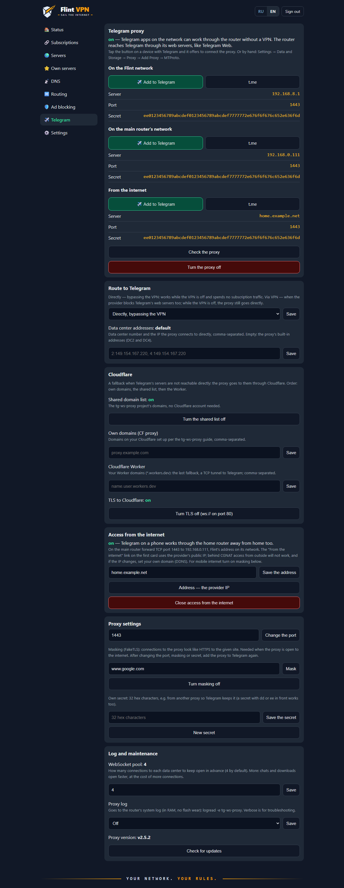
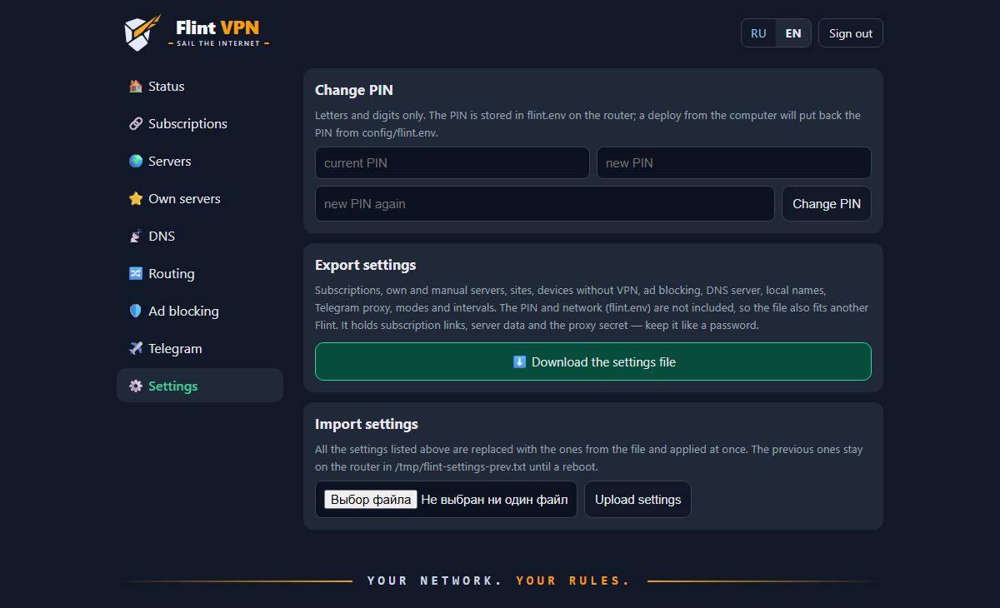
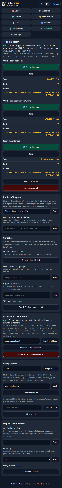

<p align="center">
  <picture>
    <source media="(prefers-color-scheme: dark)" srcset="kit/files/www/flint/logo.svg">
    
  </picture>
</p>

<h1 align="center">Flint VPN</h1>

<p align="center">
  <b>Transparent VPN (Xray, VLESS + REALITY) for your whole home network on a GL.iNet router, with a web control panel.</b><br>
  <i>Your network. Your rules.</i>
</p>

<p align="center">
  <a href="README.md">Русский</a> ·
  <a href="#quick-start">Quick start</a> ·
  <a href="#web-panel">Web panel</a> ·
  <a href="#troubleshooting">Troubleshooting</a> ·
  <a href="CHANGELOG.en.md">Changelog</a> ·
  <a href="LICENSE.en.md">License</a>
</p>


## About

Flint VPN turns a GL.iNet router into a transparent VPN gateway. Every device on its Wi‑Fi or LAN — phones, laptops, TVs, consoles — goes online through Xray (VLESS + REALITY) with no settings or apps on the devices themselves. Russian sites can optionally go direct.

> [!NOTE]
> **Tested on GL.iNet GL-BE6500 (Flint 3e)**, GL firmware 4.x (OpenWrt 23.05), Repeater mode (the router connects to the main home router over Wi‑Fi).
>
> This build was made for personal use, for my own router. It should work on other OpenWrt devices too (aarch64 first of all), but it has not been tested there — see [Other OpenWrt routers](#other-openwrt-routers).

**Why a custom web panel.** The ready-made solution from GitHub I was using simply refused to start on this router. So the Xray setup, server switching and everything else are done here from scratch: a set of shell scripts and a lightweight CGI panel running on the stock `uhttpd`, with no Node.js, Python or other heavy dependencies on the router.

The panel is available in English and Russian: the language follows your browser, and there is an RU | EN switch in the top right corner.

## Features

- **Transparent VPN for the whole network.** Client TCP traffic is redirected into Xray; nothing to configure on devices.
- **Russia geo filter.** Russian sites (`geosite:category-ru`) and IPs (`geoip:ru`) go direct, the rest via VPN. One button turns it off (everything via VPN).
- **Your own rules.** Sites, IPs and subnets "always direct" or "always via VPN", taking priority over the geo filter.
- **Devices without VPN.** Selected clients (a TV, console or work laptop) always go online directly by MAC address; the rest still go via VPN.
- **Web panel** at `http://vpn.lan:81/`, protected by a PIN: server selection, VPN on/off, routing, own servers, subscriptions, ad blocking, Telegram proxy, PIN change, settings export and import. Works on phones.
- **Subscriptions from any providers.** Add several subscriptions in the v2rayN / Happ / Hiddify format — servers from all of them show up in the panel, grouped by provider. The subscription name, expiry date and traffic are picked up automatically. The list is refreshed on demand or automatically (every 30 minutes to once a day); the router downloads subscriptions directly, so refreshing works even when the current server is down.
- **Own servers.** Add by `vless://` link, by copying a subscription server, or manually; TCP (xtls-rprx-vision) or gRPC transport.
- **Failover.** Every 2 minutes the router checks the tunnel; if the server stopped responding while the internet is up, it refreshes the subscription and switches to the first working server.
- **White lists.** Provider servers given by bare IP (for networks where only a white list is open) are grouped in a separate collapsible block.
- **Encrypted DNS** (dnscrypt-proxy) against DNS spoofing; client DNS queries are forced through the router. The panel has three modes, each with its own server:
  - **DoH** (default): Cloudflare, Google, Quad9, AdGuard DNS or your own `https://…` address;
  - **DNSCrypt** — a fallback when DoH is blocked on the network: AdGuard, Quad9, dnscry.pt or your own `sdns://…` stamp;
  - **plain UDP**: Cloudflare, Google, Quad9, AdGuard, Yandex, the main router's DNS or your own IPs.
- **Ad blocking** for the whole network at the DNS level — AdGuard Home from the GL firmware, one button to turn it on. The default list is AdGuard DNS filter, the DNS version of the filters in paid AdGuard; add your own lists by URL and your own rules. Lists update by themselves, individual devices and sites can be excluded, and a recently blocked domain is allowed with one button.
- **Telegram proxy** on the router ([tg-ws-proxy-rs](https://github.com/valnesfjord/tg-ws-proxy-rs)): Telegram works without the VPN — on devices without VPN, while the VPN is off, and without spending subscription traffic. It is added to Telegram with a button from the panel; the route to Telegram (directly or via VPN), the Cloudflare fallback and access from the internet are switches in the panel.
- **Home network access.** The main router's LAN, NAS and printer are reachable directly, bypassing the VPN; local names (`nas01`) are set in the panel.
- **Backup and restore** with one command; redeploying keeps the settings made in the panel. The panel settings can also be downloaded as a file and uploaded to the same or another Flint right from the browser.
- **Survives a firmware upgrade** with Keep Settings: the VPN, panel and all settings stay, no redeploy needed.

## Screenshots

| Login | Status |
|---|---|
|  |  |
| **Subscriptions** | **Servers** |
|  |  |
| **White lists** | **Own servers** |
|  |  |
| **Editing a server** | **DNS** |
|  |  |
| **Routing** | **Ad blocking** |
|  |  |
| **Telegram proxy** | **Settings** |
|  |  |
| **Phone** | **Phone: servers** |
|  |  |
| **Phone: Telegram** | **No servers** |
|  |  |

The screenshots use demo data: documentation IP ranges, made-up servers and keys.

## How it works

```
 Phone / laptop / TV
          │  Wi-Fi or LAN, no settings
          ▼
 ┌──────────────── Flint (OpenWrt) ────────────────┐
 │ DNS: [AdGuard Home] ──► dnsmasq ──► DoH         │
 │ iptables: TCP from br-lan ──► Xray :12345       │
 │           (devices without VPN go direct)       │
 │ Xray: RU and own "direct" ──► direct            │
 │       everything else ──► VLESS + REALITY       │
 │ uhttpd :81 ──► web panel (CGI)                  │
 └─────────────────────────────────────────────────┘
          │
          ▼
 Main router ──► internet
```

- `iptables` rules (in `/etc/firewall.user`) send client TCP traffic from `br-lan` into Xray's `dokodemo-door`. Local and private networks and the VPN servers' own addresses bypass it.
- Client DNS queries are forced to the router. With ad blocking on they go to AdGuard Home first, otherwise straight to dnsmasq; then to dnscrypt-proxy (DoH or DNSCrypt) or, in UDP mode, straight to the chosen DNS servers.
- QUIC (UDP 443) is blocked so that browsers and apps fall back to TCP and enter the tunnel. Other UDP goes direct.
- The Xray config is rendered from `/etc/xray/template.json` by `flint-node`: selected server, geo filter, own sites. It is validated with `xray -test` before being applied, and the exit IP is checked afterwards.
- The router's own traffic (subscription and package updates) goes direct.

## Requirements

**Router**
- GL.iNet with firmware 4.x (OpenWrt 22.03+ with fw4) or another OpenWrt router — see [below](#other-openwrt-routers);
- **aarch64** architecture (the installer checks it);
- internet access during installation (packages come from `opkg`) and ~60 MB of free space: Xray is about 27 MB, the geoip/geosite databases about 25 MB;
- SSH access as `root` (enabled by default on GL.iNet; the password is the admin panel one).

**VPN**
- a provider subscription with `vless://` links (VLESS + REALITY), as used by Happ, v2rayN or Hiddify, or your own VLESS + REALITY server.

**Computer for installation**
- Windows 10/11 with PowerShell and the built-in OpenSSH, **or** macOS / Linux with `ssh` and `tar`.

## Quick start

### 1. Get the project

```sh
git clone https://github.com/AndreyTokarev/Flint_Vless.git
cd Flint_Vless
```

Or download a ZIP: green **Code → Download ZIP** button on GitHub, then unpack it.

### 2. Prepare the router

1. Open the GL.iNet admin panel at `http://192.168.8.1` and set the admin password.
2. Connect the router to the internet. Tested in **Repeater** mode: *Internet → Repeater* → pick your main router's Wi‑Fi. A cable in WAN works too — then set `UPSTREAM_IF=wan` below.
3. Make sure the internet works on the router (green connection status in the admin panel).
4. If the router was reset and you have connected to it over SSH before, remove the old host key:
   ```sh
   ssh-keygen -R 192.168.8.1
   ```

### 3. Add an SSH key (recommended)

Without a key you will type the `root` password several times per deploy.

```powershell
# Windows (PowerShell). No key yet? ssh-keygen -t ed25519
Get-Content "$HOME\.ssh\id_ed25519.pub" | ssh root@192.168.8.1 "cat >> /etc/dropbear/authorized_keys && chmod 600 /etc/dropbear/authorized_keys"
```

```sh
# macOS / Linux
cat ~/.ssh/id_*.pub | ssh root@192.168.8.1 "cat >> /etc/dropbear/authorized_keys && chmod 600 /etc/dropbear/authorized_keys"
```

Check: `ssh root@192.168.8.1 echo ok` should print `ok` without asking for a password.

### 4. Fill in `config/flint.env`

```powershell
Copy-Item config\flint.env.example config\flint.env     # Windows
```
```sh
cp config/flint.env.example config/flint.env              # macOS / Linux
```

The minimum to fill in:

| Setting | Value |
|---|---|
| `UI_PIN` | panel PIN (letters and digits) |
| `SUB_URL` | subscription URL (the one you add to Happ / v2rayN). May be left empty: add the subscription later in the panel |
| `UPSTREAM_IF` | `sta1` — router on Wi‑Fi (Repeater), `wan` — on a cable |
| `UPSTREAM_NET` | main router's network, e.g. `192.168.0.0/24` or `192.168.1.0/24` |

All settings are described in [Settings](#settings-configflintenv). `config/flint.env` is never committed.

### 5. Set servers manually in `config/nodes.conf` (optional)

Usually not needed. If `SUB_URL` is set, the router downloads the subscription's servers during the install and keeps the list fresh by itself. The install also works without servers: devices go online directly until you add a subscription on the Subscriptions tab (or an own server on the Own servers tab), then the VPN turns on by itself.

With no subscription, only a server link, copy `config/nodes.conf.example` to `config/nodes.conf` and add the server from the link (or add it after the install on the Own servers tab):

```
vless://UUID@ADDRESS:PORT?type=tcp&security=reality&sni=SNI&pbk=PBK&sid=SID&flow=xtls-rprx-vision#NAME
```

```
# 🇳🇱 Netherlands
nl  ADDRESS  SNI  PBK  SID  UUID  PORT
```

The comment line above a server is its name in the panel. An empty `sid` is written as `-`. The first field is a short code (`nl`); after the install the server with the `DEFAULT_NODE` code from `flint.env` is enabled, or the first one if there is no such code.

### 6. Install

From the project root:

```powershell
.\deploy.ps1                       # Windows
.\deploy.ps1 -Router 192.168.8.1   # if the router has another address
```
```sh
./deploy.sh                        # macOS / Linux
./deploy.sh 192.168.8.1
```

> [!TIP]
> If PowerShell says running scripts is disabled, allow it for the current window:
> `Set-ExecutionPolicy -Scope Process Bypass`

The script packs the kit, uploads it and runs `install.sh` on the router. It takes a few minutes: packages are installed, Xray and the geoip/geosite databases (~25 MB) are downloaded. At the end you will see:

```
DNS: ok
VPN exit IP: 203.0.113.42
Panel: http://vpn.lan:81/  (PIN from flint.env)
```

`VPN exit IP` is the VPN server's address, not your home one. If you get `VPN: FAIL` instead, see [Troubleshooting](#troubleshooting).

### 7. Open the panel

Connect to the router's Wi‑Fi and open **http://vpn.lan:81/** (or `http://192.168.8.1:81/`), enter the PIN from `flint.env`. To check the VPN, open any site like [ifconfig.me](https://ifconfig.me): it should show the VPN server's address.

You can rerun the installation any number of times — for example after changing `flint.env` or updating the project. Settings made in the panel (own servers, sites, update interval) are kept.

## Web panel

Address: **http://vpn.lan:81/** (port 80 is taken by the stock GL.iNet admin panel). The panel is reachable only from the router's LAN and from the main router's network (`UPSTREAM_NET`).

| Tab | What's there |
|---|---|
| **Status** | VPN on/off button, current server, IP via VPN and the provider IP (before VPN), geo filter, number of own sites and servers, last subscription check, failover state and last failure, ad blocking, DNS server, Telegram proxy |
| **Subscriptions** | VPN provider subscriptions: add by link, change the link or name, delete; last update, number of servers, expiry and traffic; "Update all subscriptions now" and the auto-update interval |
| **Servers** | one-click server selection — servers grouped by subscription, own servers apart; "White lists" block; failover on/off |
| **Own servers** | servers not from the subscription: add by `vless://` link, copy a subscription server and edit the copy, enter manually; edit or delete |
| **DNS** | DoH, DNSCrypt or plain UDP mode with a server for each — a preset or your own; the mode in use is marked. Local names for network devices (`nas01` → IP) |
| **Routing** | Russia geo filter on/off; devices without VPN (by MAC); own sites, IPs and subnets "always direct" or "always via VPN" |
| **Ad blocking** | ad blocking on/off and 24-hour stats; devices without blocking; sites without blocking and "Recently blocked" with an Allow button; filter lists — ready-made and your own by URL; auto-update and "Update the lists now"; own rules |
| **Telegram** | Telegram proxy on/off and a check; "Add to Telegram" buttons for the Flint network, the main router's network and the internet, plus server, port and secret for manual entry; route to Telegram — directly or via VPN; Cloudflare fallback; access from the internet; port, masking (FakeTLS), a new or own secret; data center addresses, own Cloudflare domains and Worker, connection pool, proxy log, update check |
| **Settings** | change the PIN; export the settings to a file and import them from a file (subscriptions, servers, sites, devices without VPN, ad blocking, DNS, local names, Telegram proxy, modes; no PIN or network) |

The panel speaks English and Russian. On the first visit the language follows the browser (or `UI_LANG` in `flint.env`); after that use the **RU | EN** switch in the top right corner (next to "Sign out"; on the login page too) — the choice is remembered in the browser. Messages after panel actions use the same language.

## Settings `config/flint.env`

| Setting | Description |
|---|---|
| `VLESS_UUID` | optional: UUID for `config/nodes.conf` lines without one (subscription and own servers carry their own) |
| `UI_PIN` | panel PIN (letters and digits only). It can also be changed in the panel (Settings), but a deploy writes the value from here to the router — after changing it in the panel, update it here or run a backup. A forgotten PIN can be set over SSH, see [Troubleshooting](#troubleshooting) |
| `UI_TITLE` | text of the panel logo, default `Flint VPN` (the last word is gold) |
| `UI_TAGLINE` | tagline under the logo, default `Sail the internet`; an empty value removes it |
| `UI_LANG` | default panel language: `ru` or `en`; empty — follow the browser. Background records (last subscription check, last failure) are written in it too |
| `DEFAULT_NODE` | server code enabled after installation (usually `auto`); the first server if there is no such code |
| `ROUTING` | `ru` — Russian sites and IPs direct, the rest via VPN; `global` — everything via VPN. The `geoip.dat`/`geosite.dat` databases (Loyalsoldier) are downloaded on install and updated on Sundays at 4:30; without them the router runs in `global` mode. Sets the mode only on a fresh router; after that it is switched in the panel |
| `UPSTREAM_IF` | main router interface: `sta1` (Wi‑Fi, Repeater) or `wan` (cable) |
| `UPSTREAM_NET` | main router's network; reachable from devices behind Flint without the VPN, and Flint is reachable from it |
| `LOCAL_HOSTS` | initial list of local names: `"nas01=192.168.0.145 printer=192.168.0.50"` — `nas01`, `nas01.lan`, `nas01.local` will resolve. Applies only to a fresh router; after that the names are edited in the panel (DNS → Local names) |
| `SUB_URL` | optional: the first subscription on a fresh router; more are added on the Subscriptions tab (see [Subscriptions](#subscriptions)) |
| `SUB_INTERVAL` | auto-update interval for a fresh router: `off`, `30m`, `1h`, `3h`, `6h`, `12h`, `24h` (default `24h`); later changed in the panel, survives redeploys |
| `SUB_GRPC` | `1` — also import gRPC servers from the subscription (skipped by default, see [Limitations](#limitations)) |
| `ADBLOCK` | `on` — turn ad blocking on for a fresh router; later it is switched in the panel, and the choice survives redeploys |
| `XRAY_VERSION` | Xray release downloaded from GitHub if `xray-core` is not available in `opkg` (default `v1.8.24`) |

## Servers `config/nodes.conf`

The router builds subscription servers by itself (`flint-sub-update`, see [Subscriptions](#subscriptions)). `config/nodes.conf` holds only manually set servers; when the file exists, a deploy uploads it to the router, otherwise the router keeps its copy. From subscriptions VLESS + REALITY over TCP (xtls-rprx-vision) is imported, including bare-IP servers, which go to the "white lists" block. gRPC only with `SUB_GRPC=1`. Provider announcements disguised as servers (names starting with ❗) are skipped.

Line format:

```
code  address  sni  pbk  sid  [uuid]  [port]  [tcp|grpc]  [serviceName]
```

An empty field is `-`; `uuid` defaults to `VLESS_UUID`, port to `443`, transport to `tcp`. The comment line above a server is its panel name.

**Own servers** added in the panel are stored separately on the router, in `/etc/xray/nodes-custom.conf`, with codes `my1`, `my2`… Subscription updates don't touch them.

## Subscriptions

You can have several subscriptions from different providers: add, change and delete them on the Subscriptions tab or with `flint-sub-update`. A regular subscription link from Happ, v2rayN or Hiddify works — a list of `vless://` links (plain or base64). On the first run `SUB_URL` from `flint.env` becomes the first subscription.

- A subscription is added only if it downloads and has supported servers (VLESS + REALITY).
- Each subscription's servers live in `/etc/xray/nodes.d/<id>.conf`, own servers in `nodes-custom.conf`, manual ones in `nodes.conf`. When codes clash, the second server gets a number: `de`, `de2`.
- If a subscription fails to download during an update, its servers stay as they were and the panel shows the error.
- The default subscription name comes from the `profile-title` header, the expiry and traffic from `subscription-userinfo` (most providers send them for Happ).
- The hosts of all subscriptions bypass the VPN, so refreshing works even when the current server is down.
- The list lives in `/etc/xray/subscriptions` (links carry a token, keep it secret); a backup copies it to `config/subscriptions`.
- There may be no subscriptions at all, e.g. right after an install without `SUB_URL` or after deleting the last one. With no own servers either, Xray stays down and devices go online directly; the Status tab shows it. The first subscription or own server added turns the VPN on by itself.

## Failover

`flint-watchdog` runs from cron every 2 minutes: it checks the tunnel (a request to `generate_204` through Xray); on failure it waits 10 seconds and checks again; if the direct internet works (so it's the server, not the ISP), it refreshes the subscription; if the current server still fails, it tries the others in order and stays on the first working one, or returns to the original if none works. The last result is shown in the panel and in `/etc/xray/watchdog-last`. Turn it off in the panel or with `flint-watchdog off`.

## Ad blocking

Works at the DNS level for every device on the network, with no apps on the devices. It uses AdGuard Home, which already ships with GL.iNet firmware 4.x (`/usr/bin/AdGuardHome`): the project runs its own instance on `127.0.0.1:5054`. The stock AdGuard Home from the GL admin panel stays off — don't turn both on.

How it works:
- with blocking on, the firewall (`FLINT_DNS` chain) sends client DNS queries to AdGuard Home, which forwards them to dnsmasq, so local names and DoH keep working;
- devices in "Devices without blocking" (by MAC address) go straight to dnsmasq;
- every 2 minutes cron checks that AdGuard Home answers. If not, it restarts it, and if that fails, DNS bypasses it until it is back. The ad blocker never takes the internet down;
- the AdGuard Home web UI is not exposed (`127.0.0.1` only); everything is managed from the panel.

**Lists.** The default is [AdGuard DNS filter](https://github.com/AdguardTeam/AdGuardSDNSFilter): the DNS version of the filters in paid AdGuard products (Base, Tracking Protection, Mobile Ads, Russian and other regional ad servers, EasyList, EasyPrivacy). It is free and open. The panel adds ready-made lists from the [AdGuard registry](https://github.com/AdguardTeam/HostlistsRegistry) (Popup Hosts, HaGeZi Pro, OISD, Steven Black, phishing and malware protection) or any list by URL in AdGuard/Adblock or hosts format. More lists mean more false positives, so start with one.

**Updates.** Lists update automatically — once a day by default, from every hour to once a week, or off — and with the "Update the lists now" button.

**Own rules:**

| What you enter | Result |
|---|---|
| `ads.example.com` or a link, "Block" | the domain is blocked with its subdomains (`\|\|ads.example.com^`) |
| the same, "Allow" | an exception (`@@\|\|ads.example.com^`) when a list blocks a site you need |
| `\|\|ads.*^`, `/^ad[0-9]+\./`, `@@\|\|site.com^` | a rule in [AdGuard syntax](https://adguard-dns.io/kb/general/dns-filtering-syntax/) as is |

Rules take effect in a few seconds.

**Sites without blocking.** If blocking broke a site you need, add it to "Sites without blocking" — the same "Allow" rule for a domain with its subdomains, kept as a separate list. Below it, "Recently blocked" lists the latest blocked domains with the device name, each with an Allow button. The query log is kept in memory only (the last 1000 queries); nothing is written to flash.

AdGuard Home uses 40–60 MB of RAM; with blocking off it is stopped.

### Where ads remain

DNS blocking sees only the names of the sites a device connects to, not the page content. Hence the limits:

- **Ads from the same domain as the content stay.** VK (ad blocks in the feed and the left column), YouTube (pre-roll and mid-roll ads), Instagram, Facebook, Yandex search and Dzen serve ads from their own servers together with the feed, and the ad images come from the same hosts as post photos. DNS can block such ads only together with the site itself, so a "Block" rule for `vk.com` or `youtube.com` will not help — it just breaks the site.
- **Page elements are not hidden.** An empty frame or placeholder may stay where a blocked banner was.
- **In-app ads** (YouTube on a TV, social network apps on a phone) are removed only partly, for the same reason.

On such sites only a blocker on the device itself helps: the [uBlock Origin](https://ublockorigin.com/) extension in a desktop browser, Firefox with uBlock Origin on Android. It hides ad blocks right on the page and complements the router nicely: the router closes ad and tracker domains for every device, TVs and apps included, and the extension handles what comes from the site itself.

**Who bypasses the blocking.** Devices whose DNS queries skip the router:
- Android with Private DNS on;
- browsers with secure DNS (DoH): Chrome, Edge, Firefox, Yandex Browser;
- devices running a VPN client (Happ, v2rayN, Hiddify, etc.): DNS and all traffic go into its tunnel, so neither the blocking nor the router's VPN apply. Behind Flint a VPN client isn't needed — turn it off.

More on device settings in [Devices on the network](#devices-on-the-network). If a site you need broke after turning blocking on, add it to "Sites without blocking" or add the device to "Devices without blocking".

## Telegram proxy

An MTProto proxy on the router — [tg-ws-proxy-rs](https://github.com/valnesfjord/tg-ws-proxy-rs), the Rust version of [Flowseal/tg-ws-proxy](https://github.com/Flowseal/tg-ws-proxy). The Telegram app connects to the router as to a regular MTProto proxy, and the router reaches Telegram through its web servers over WebSocket on top of TLS — the same way Telegram Web does in a browser. The provider sees an HTTPS connection to a Telegram web server, not the MTProto protocol, which gets cut by its signature.

### Why it is needed

With the VPN on, Telegram on devices behind Flint works anyway: its servers are not Russian, so the geo filter sends them through VLESS. The proxy is for when Telegram has to work **without the VPN**:

- on **devices without VPN** (Routing → Devices without VPN) — their traffic bypasses Xray, and the provider may slow Telegram down or break it;
- while the **VPN is off** or the subscription servers are down — Telegram keeps working through the proxy;
- **without spending subscription traffic** — photos, videos and files bypass VLESS (the "Directly" route);
- **away from home**, with access from the internet open: a phone on mobile data reaches Telegram through the home router.

While the proxy is off or not added to Telegram on a device, Telegram follows the router's usual rules like all other traffic.

### Turning it on

1. Telegram → Turn the proxy on. The proxy is already on the router (a deploy installs it), so it starts right away; the panel waits until it listens on the port.
2. Open the Telegram tab on a device with Telegram and tap **"Add to Telegram"** — Telegram offers to connect the proxy. The `t.me` button next to it is the same link through Telegram's site, in case the app did not open on `tg://`.
3. By hand: *Settings → Data and Storage → Proxy → Add Proxy → MTProto*, with the server, port and secret from the same tab.

There are up to three links, each with its own server address:

| Link | Server | For |
|---|---|---|
| On the Flint network | `192.168.8.1` (the router's LAN address) | devices on Flint's Wi‑Fi or LAN |
| On the main router's network | Flint's address on the main router's network, e.g. `192.168.0.111` | devices on the main router's Wi‑Fi; shown when `UPSTREAM_NET` is set |
| From the internet | the provider IP or your own domain | a phone away from home; shown when access from the internet is on |

### How it works

```
 Telegram (phone, PC)
    │  MTProto obfuscated with the secret (dd…), with masking wrapped in TLS (ee…)
    ▼
 Flint :1443 ── tg-ws-proxy ─┬─► WebSocket over TLS :443 → kwsN.web.telegram.org ─► Telegram data center
                             ├─► fallback: Cloudflare (kwsN.<listed domain>)       ─► Telegram data center
                             └─► last resort: TCP :443 straight to the data center
    "Via VPN": every outgoing connection of the proxy goes into Xray (HTTP inbound 127.0.0.1:1087) ─► VLESS
```

1. **Connecting to the router.** Telegram opens a TCP connection to the router on the proxy port (1443). It is an address inside the network, so Xray leaves it alone even when the device itself goes via the VPN.
2. **Handshake and secret.** The first 64 bytes are an obfuscated MTProto handshake. From it the proxy checks the secret and learns the data center (DC) number and the connection type: regular or media (photos, videos, files). A connection without the right secret is dropped, so knowing the address and port is not enough to use the proxy.
3. **The WebSocket bridge.** The proxy opens a WebSocket connection `wss://kwsN.web.telegram.org/apiws` — the Telegram Web entrance for data center N. TCP goes to the data center's IP, while TLS carries the web server's name, so from outside it looks like ordinary HTTPS to Telegram Web. The stream is re-encrypted with AES-256-CTR (client keys ↔ bridge keys). The proxy does not see the messages: Telegram itself encrypts them, and the proxy passes on data that is already encrypted.
4. **Connection pool.** For each data center the proxy keeps 4 WebSocket connections open in advance, so new chats and downloads do not wait for a TLS handshake.
5. **Fallbacks.** Each connection takes the first route that works: direct WebSocket → Cloudflare (if the fallback is on) → a direct TCP connection to the data center on port 443. The Cloudflare fallback uses the shared domain list of the tg-ws-proxy project: the proxy downloads it from GitHub at startup and, if GitHub is unreachable, uses a short built-in list. Behind these domains are the same `kwsN` entrances, but the provider sees a connection to Cloudflare. If TCP to a data center address hangs until a timeout — which is what DPI blocking usually looks like — the proxy steps over that address for an hour and goes straight to a fallback. A refused connection does not count. If the fallbacks fail too, the address is tried again, and the first direct connection that succeeds clears the cooldown.
6. **Route to Telegram.** "Directly": the proxy goes out to the internet as the router itself — the router's own traffic is not sent into Xray (interception covers only traffic from the LAN), so no VPN traffic is spent. "Via VPN": every outgoing connection of the proxy, the Cloudflare fallback included, goes into Xray's HTTP inbound on `127.0.0.1:1087` and then follows Xray's rules: Telegram's addresses are not Russian, so they go through VLESS. While the VPN is off or there are no servers, the proxy switches to "Directly" by itself and back once the VPN is on again.
7. **Masking (FakeTLS).** With it the proxy accepts only clients with an `ee…` secret: the connection from the phone to the router starts as a TLS handshake with the given site (e.g. `www.google.com`). This protects the "phone → router" leg when it goes over the internet and a mobile operator. Masking does not change the router's path to Telegram.

### How it is set up on the router

| What | Where |
|---|---|
| Proxy | `/usr/bin/tg-ws-proxy` — a static aarch64 binary (3.8 MB), installed on every deploy from the archive in `kit/bin/` |
| Service | `/etc/init.d/flint-tgproxy` (procd, restarted if it crashes). Enabled at boot only while the proxy is on in the panel |
| Settings | `/etc/xray/tgproxy`, mode 600: `state`, `route`, `cf`, `remote`, `addr`, `mask`, `port`, `secret`, `dc`, `cfdomain`, `worker`, `cftls`, `pool`, `log` |
| Control | `flint-tg` — used by the panel, `install.sh` and `firewall.user` |
| Firewall | from the Flint network the router is open through the `lan` zone; from the main router's network through the `Allow-Upstream-LAN-to-Router` rule; from the internet through `Allow-Flint-Telegram-Proxy` (`firewall.flint_tg_remote`), which exists only while access from the internet is on and follows port changes |

Details:

- **The command line** comes from `flint-tg args`: `--host 0.0.0.0 --port <port> --link-ip <LAN address>`, plus `--default-domains` (Cloudflare fallback), `--listen-faketls-domain <site>` (masking) and `--outbound-proxy http://127.0.0.1:1087` (route via VPN, while the VPN works). The secret is passed in the `TG_SECRET` environment variable, so it does not show in the process list (`ps`).
- **Sync.** `flint-tg sync` runs at the end of `/etc/firewall.user`, that is when the VPN is turned on or off, the server changes, the firewall reloads and the router boots. It restarts the proxy only when the command line or secret changed (the last ones are kept in `/tmp/flint-tg.applied`), so open Telegram connections are not dropped for nothing.
- **The secret** is 16 random bytes (32 hex characters), created on first use. The link: `tg://proxy?server=<address>&port=<port>&secret=dd<secret>`, with masking `secret=ee<secret><site domain in hex>`.
- **The check** ("Check the proxy", `flint-tg check`) starts a second copy of the proxy with the same settings on the next port (`port + 1`, `127.0.0.1` only) with `--check-listener`. That copy connects to itself as a Telegram client — handshake, a `req_pq_multi` request, a `resPQ` answer from the data center — checks the Cloudflare domains and prints an `[OK]` / `[FAIL]` line per route. The running proxy is not touched.

### Where the proxy comes from

So as not to depend on whether the project is still on GitHub, the release archive is kept in the repository: `kit/bin/tg-ws-proxy-aarch64-unknown-linux-musl.tar.gz` (v2.5.2) with its MIT license `kit/bin/tg-ws-proxy-LICENSE`. A deploy uploads it with the kit, and `install.sh` checks the archive's SHA-256 against the sum in `flint-tg` and installs `/usr/bin/tg-ws-proxy`. If the archive is missing from the kit or damaged, the install goes on without the proxy, and `flint-tg on` (the panel button) downloads the same archive from GitHub — via the VPN first, then directly — and checks the same sum. A foreign or modified file will not be installed.

**Updating the proxy to a new version:**

1. Download `tg-ws-proxy-aarch64-unknown-linux-musl.tar.gz` from the [tg-ws-proxy-rs releases](https://github.com/valnesfjord/tg-ws-proxy-rs/releases) and replace the archive in `kit/bin/` with it.
2. In `kit/files/usr/bin/flint-tg` change `VERSION` and `SHA256` (the archive's sum: `Get-FileHash <file> -Algorithm SHA256` or `sha256sum <file>`; GitHub shows it next to the file in the release).
3. Redeploy. The proxy restarts on the new version with the same settings and secret — the links in Telegram stay the same.

### What does not go through the proxy

- **Telegram calls.** An MTProto proxy does not carry them. Calls follow the network's usual rules: UDP behind Flint is not tunneled and goes directly.
- **Telegram Web in a browser.** It is an ordinary site and follows the router's rules — via the VPN, if it is on.
- **Devices where the proxy is not added in Telegram.** The proxy is not transparent: it works only once set up in the app.

**Switches:**

| Setting | What it does |
|---|---|
| Route to Telegram | **directly, bypassing the VPN** (default) or **via VPN** — when the provider blocks Telegram's web servers too. While the VPN is off, the proxy goes directly anyway |
| Cloudflare fallback | if Telegram's servers are not reachable, the proxy goes to them through Cloudflare, using the shared domain list of the tg-ws-proxy project (on by default) |
| Access from the internet | opens the proxy port in the WAN zone, so Telegram on a phone works through the home router away from home. Needs a TCP port forward on the main router to Flint's address there and a public IP from the provider (it won't work behind CGNAT). The address in the link is the provider IP or your own domain (DDNS) |
| Port | 1443 by default |
| Masking (FakeTLS) | connections to the proxy look like HTTPS to the given site (a link with an `ee…` secret). Turn it on when the proxy is open to the internet: without it a mobile operator may spot the proxy |
| New secret | the old links stop working |
| Own secret | 32 hex characters, e.g. from the desktop tg-ws-proxy, so Telegram keeps its secret (a secret with `dd`/`ee` in front works too) |
| Data center addresses | number:IP, comma-separated (`--dc-ip`): the addresses the proxy connects to directly. Empty: the built-in ones (DC2 and DC4) |
| Cloudflare: own domains | domains on your Cloudflare (`--cf-domain`), tried before the shared list |
| Cloudflare Worker | your Worker domains (`--cf-worker-domain`): the last fallback, a TCP tunnel to Telegram |
| TLS to Cloudflare | off means `ws://` on port 80 (`--cf-disable-tls`), only for providers that cut TLS to Cloudflare |
| WebSocket pool | how many connections to each data center to keep open in advance (`--pool-size`, 4 by default) |
| Proxy log | off, on or verbose (`--verbose`); goes to the router's in-memory system log (`logread -e tg-ws-proxy`), the last lines show on the tab |
| Check for updates | compares the installed version with the latest on GitHub. It does not update by itself: the version is pinned in the kit, see [Where the proxy comes from](#where-the-proxy-comes-from) |

The desktop tg-ws-proxy's "Buffer, KB" is not carried over: the Rust version accepts it but does not use it.

After changing the port, masking or secret, add the proxy to Telegram again. "Check the proxy" starts a second copy of the proxy with the same settings, walks the whole path — from a client connection to an answer from Telegram's servers — and shows the result for each route (`[OK]` / `[FAIL]`).

### Resources, backup, firmware

- The proxy takes 3–5 MB of memory and 3.8 MB of flash; it is stopped while off.
- Its settings and secret (`/etc/xray/tgproxy`) go into backups and the panel's settings file and come back with `restore` — the links in Telegram keep working after a restore.
- A firmware upgrade with Keep Settings keeps the proxy along with the rest of the kit (see [Firmware upgrade](#firmware-upgrade)). Without it a redeploy installs the proxy again from `kit/bin/`, with no internet needed for that.
- `uninstall` stops the proxy and removes the binary, the service and the firewall rule.

## Access from the main router's network

`install.sh` allows incoming connections from `UPSTREAM_NET` to Flint and to devices behind it (`192.168.8.x`). If the main router's network changes, update `UPSTREAM_IF` / `UPSTREAM_NET` in `config/flint.env` and redeploy. On the main router, add a DHCP reservation for Flint (e.g. `192.168.0.111`) and a static route: network `192.168.8.0`, mask `255.255.255.0`, gateway `192.168.0.111`.

Fix the addresses of the main network's devices you reach through Flint (NAS, printer) as well — with a DHCP reservation on the main router or a static IP on the device. Otherwise a device may get another address after a reboot, and its local name will point nowhere.

## Backup

```powershell
.\backup.ps1               # router configs -> backup\<date>\router-config.tar.gz, refreshes config\
.\backup.ps1 -WithBinary   # plus backup\bin\xray (~27 MB) — useful if opkg is unavailable
```
```sh
./backup.sh
./backup.sh --with-binary
```

The backup pulls from the router its settings, the own servers and sites from the panel, and the network and Wi‑Fi configs. The user files listed in `kit/state-files` (`flint.env`, servers, subscriptions, sites, ad blocking files) are saved as one archive, `backup\<date>\state.tar.gz`, and also copied into `config/`, which the deploy uploads later. This includes `flint.env` with the PIN, if it was changed in the panel.

Without a computer, the panel settings can be saved as a file: Settings → "Download the settings file" (or `flint-settings export` on the router). It is not a full backup: `flint.env`, the network and Wi‑Fi are not included.

> [!WARNING]
> `backup/` and the files in `config/` contain your subscription UUID and Wi‑Fi passwords. They are gitignored; keep them separately — in the cloud or on a USB stick.

## Restore from a backup

```powershell
.\restore.ps1                                   # latest backup\<date>
.\restore.ps1 -Backup backup\2026-10-03_1557    # a specific one
.\restore.ps1 -Full                             # plus network, Wi-Fi, firewall, DHCP, SSH keys and a reboot
```
```sh
./restore.sh
./restore.sh backup/2026-10-03_1557
./restore.sh --full
```

By default `flint.env`, servers, subscriptions, own servers and sites, ad blocking lists, rules and exclusions from the backup go into `config/`, then a normal deploy runs, and after it every panel setting from the backup comes back to the router: the chosen server, VPN and routing modes, DNS, local names, ad blocking, the Telegram proxy (with the same secret, so the links in Telegram keep working), intervals and the watchdog. This works for a reset router too: first connect it to the internet in the GL admin panel. The current `config/` files are saved to `backup/config-before-restore-<time>/` before being replaced.

`-Full` / `--full` is only for the **same** router: it brings back its network, Wi‑Fi (SSIDs and passwords), firewall, DHCP reservations, cron and SSH keys, then reboots. The script asks for confirmation (`-Yes` / `--yes` skips it).

## Firmware upgrade

Upgrade the firmware with **Keep Settings** checked, and Flint VPN survives the upgrade: after the reboot the VPN, panel, subscriptions, ad blocking and Telegram proxy work as before, no redeploy needed.

**How it works.** An upgrade wipes everything installed on top of the firmware, and with Keep Settings it carries over only `/etc/config/*` (network, Wi‑Fi, DHCP, firewall rules) and files from explicit lists. `install.sh` puts such a list into `/lib/upgrade/keep.d/flint` — the standard OpenWrt place `sysupgrade` reads before flashing. The list holds:

| What | Paths |
|---|---|
| Settings, servers, subscriptions, PIN | `/etc/xray` |
| Scripts, panel, services | `/usr/bin/flint-*`, `/usr/share/flint`, `/www/flint`, `/etc/init.d/xray`, `/etc/init.d/flint-*` |
| Service autostart | links `/etc/rc.d/*xray`, `/etc/rc.d/*flint-*` |
| Xray, geoip/geosite databases, Telegram proxy | `/usr/bin/xray`, `/usr/share/xray`, `/usr/bin/tg-ws-proxy` |
| Traffic interception, DNS, ad blocking | `/etc/firewall.user`, `/etc/dnsmasq.d/flint-*.conf`, `/etc/dnscrypt-proxy2/flint-doh.toml`, `/etc/flint-adguard` |
| Cron jobs (subscriptions, watchdog, geo databases) | `/etc/crontabs/root` |

The list includes itself, so the next upgrade keeps everything too. With Xray and the geo databases about 60 MB go into the upgrade archive — fine for this router.

**Check beforehand** without changing anything: `sysupgrade -l` on the router prints the files that will be kept. It should list `/etc/xray/…`, `/usr/bin/flint-…`, `/www/flint/…`. A deploy checks this itself and ends with `Firmware upgrade with "Keep settings": Flint stays (N files)`.

**When a deploy or restore is still needed:**

- upgraded **without** Keep Settings or reset the router — `.\restore.ps1 -Full` (or a normal deploy and setting up again);
- the new firmware is on another major OpenWrt version (e.g. 23.05 → 24.10) and something does not work after the upgrade — redeploy: it rewrites the kit's files, and the settings in `/etc/xray` stay;
- packages `install.sh` installed with `opkg` (`dnscrypt-proxy2`, `iptables-nft`, etc., if the firmware lacked them) are removed by the upgrade — a redeploy brings them back. GL firmware 4.x already has them; Xray itself is kept as a file.

Make a backup before a firmware upgrade anyway (`.\backup.ps1`), in case something goes wrong.

## Uninstall

```powershell
.\uninstall.ps1               # back up, then uninstall
.\uninstall.ps1 -KeepXray     # keep the xray-core package
.\uninstall.ps1 -NoBackup     # no backup
```
```sh
./uninstall.sh
./uninstall.sh --keep-xray
./uninstall.sh --no-backup
```

The script asks for confirmation (`-Yes` / `--yes` skips it), backs up to `backup/<date>` and removes from the router everything Flint VPN installed: the panel, services, `flint-*` scripts, settings in `/etc/xray`, its own AdGuard Home instance, the Telegram proxy, firewall rules and cron jobs, the `xray-core` package and the geoip/geosite databases. The DNS settings go back to the firmware defaults: dnsmasq takes DNS from the main router again. The firmware and its packages (`dnscrypt-proxy2`, `curl`, the firmware's AdGuard Home, etc.), network, Wi‑Fi and the root password stay as they are.

After uninstalling, devices go online directly. Flint is no longer reachable from the main router's network (Flint VPN's rules did that): connect to it over Wi‑Fi or a cable. To bring everything back, run `.\restore.ps1` / `./restore.sh` with the backup just made.

To uninstall by hand, without a computer with the project: upload `kit/uninstall.sh` to the router and run `sh uninstall.sh` (or `sh uninstall.sh --keep-xray`).

## Router commands

```sh
flint-node list                  # current server and codes
flint-node nl                    # switch to server nl (with an exit IP check)
flint-node routing ru            # geo filter: RU direct (global — everything via VPN)
flint-node vpn off               # clients go online directly (on — via VPN again)
flint-node site add direct example.ru     # own site: direct — bypass VPN, proxy — via VPN
flint-node direct add aa:bb:cc:dd:ee:ff TV   # a device without VPN; list: flint-node direct, remove: direct del <MAC>
flint-custom link 'vless://...'  # add an own server by link
flint-sub-update                 # update all subscriptions
flint-sub-update list            # subscriptions: id, name, host, last update, expiry and traffic
flint-sub-update add 'https://...' "Name"   # add a subscription
flint-sub-update set s2 'https://...'      # new link (or name) for subscription s2
flint-sub-update del s2          # delete a subscription and its servers
flint-sub-update interval 1h     # auto-update: off, 30m, 1h, 3h, 6h, 12h, 24h
flint-watchdog off               # turn failover off (on — turn on)
flint-geo-update                 # update geoip/geosite manually
flint-adblock on                 # ad blocking (off — turn off)
flint-adblock list               # lists: URL, name, rules, last update
flint-adblock list add https://example.com/list.txt "Name"
flint-adblock rule add block ads.example.com   # allow — exception
flint-adblock blocked                          # recently blocked domains and devices
flint-adblock exclude add aa:bb:cc:dd:ee:ff    # device without blocking
flint-adblock refresh            # update the lists now
flint-adblock interval 24        # auto-update: off, 1, 12, 24, 72, 168 hours
flint-settings export > /tmp/s.txt   # export the panel settings (no flint.env)
flint-settings import /tmp/s.txt     # import: replaces the panel settings and applies them
flint-dns                            # current DNS: mode and server
flint-dns doh quad9                  # DoH; your own: flint-dns doh https://dns.example.com/dns-query
flint-dns dnscrypt quad9             # DNSCrypt; your own: flint-dns dnscrypt sdns://...
flint-dns udp provider               # plain DNS: a preset, provider or IPs separated by spaces
flint-dns mode doh                   # switch the mode: doh, dnscrypt, udp
flint-dns hosts                      # local names; add: flint-dns hosts add nas01 192.168.0.145, delete: hosts del nas01
flint-tg on                          # Telegram proxy (off — turn it off)
flint-tg link                        # tg://proxy link for the Flint network (upstream — main router's network, remote — internet)
flint-tg route vpn                   # route to Telegram via VPN (direct — directly)
flint-tg check                       # check the proxy up to an answer from Telegram's servers
flint-tg secret <hex>                # own secret (new: a new random one)
flint-tg dc 2:149.154.167.220        # data center addresses (default: the built-in ones)
flint-tg log verbose                 # proxy log (on, off); flint-tg logs shows the last lines
flint-tg latest                      # is there a newer proxy version on GitHub
logread -e xray                # Xray logs
```

## Devices on the network

- Devices behind Flint don't need a VPN client. If one is on anyway (e.g. Happ), its connections to the provider's servers leave Flint directly rather than through a second VPN, but such a device bypasses the router's geo filter, own sites and ad blocking: the client decides everything.
- **Android:** *Settings → Network → Private DNS → Off*, otherwise the phone bypasses the router's DNS.
- **Windows:** in the Wi‑Fi properties set *DNS server assignment → Automatic (DHCP)*; otherwise DoH bypasses the router's DNS and local names (`nas01`) don't resolve.
- **Browsers** with secure DNS (DoH) also bypass the router's DNS — the geo filter and own sites by domain still work (Xray reads the domain from TLS), local names and ad blocking don't.

## Other OpenWrt routers

Built for and tested only on the GL-BE6500. It should work elsewhere if:

- the CPU is **aarch64** (the installer stops otherwise; for `armv7`/`mips` remove the check in `kit/install.sh` and provide Xray for your architecture; the Telegram proxy in `kit/bin/` is an aarch64 build too — replace the archive and `URL`/`SHA256` in `flint-tg` with a build from the [tg-ws-proxy-rs releases](https://github.com/valnesfjord/tg-ws-proxy-rs/releases));
- the firmware is **OpenWrt 22.03+ with fw4**; rules use `iptables` in `/etc/firewall.user`, the installer adds `iptables-nft` and `iptables-mod-nat-extra` when needed;
- the LAN bridge is **`br-lan`**; the LAN address is read from `uci`;
- `UPSTREAM_IF` names the uplink interface (`wan`, `sta1`, `wwan`…);
- **port 81** is free.

If you run it on another device, please report the result in [Issues](https://github.com/AndreyTokarev/Flint_Vless/issues).

## Troubleshooting

| Symptom | What to check |
|---|---|
| `VPN: FAIL` at the end of install | is the subscription alive (Subscriptions tab); is `VLESS_UUID` correct for manual `nodes.conf` lines; is `DEFAULT_NODE` alive (try another: `flint-node <code>`); `logread -e xray` |
| `DNS: FAIL` | `/etc/init.d/flint-doh restart`, then `nslookup youtube.com 127.0.0.1`; does the router have internet |
| Panel doesn't open at `vpn.lan` | use `http://192.168.8.1:81/`; disable Private DNS / DoH on the device; `/etc/init.d/flint-ui restart` |
| No internet after switching servers | the server is down — pick another or enable failover; as a last resort turn the VPN off on the Status tab |
| A server fails though it works in Happ | the provider rotated keys or SNI — "Subscriptions → Update all subscriptions now" |
| A subscription is not added | "could not be downloaded" - open the link in a browser, check the router's internet; "no supported servers" - the subscription has no VLESS + REALITY (VMess, Trojan, Shadowsocks, XHTTP are not supported) |
| A Russian site goes via VPN | geoip/geosite missing (then `global` mode): `flint-geo-update`; or add the site as "direct" |
| A site or app broke with ad blocking on | turn blocking off to confirm; if it is the cause, allow the domain in "Sites without blocking" ("Recently blocked" gives a hint) or add the device to "Devices without blocking" |
| Forgot the PIN | see it: `ssh root@192.168.8.1 "grep UI_PIN /etc/xray/flint.env"`. Set a new one (here `1234`, letters and digits only): `ssh root@192.168.8.1 "sed -i '/^UI_PIN=/d' /etc/xray/flint.env && echo UI_PIN=1234 >> /etc/xray/flint.env"` — it works at once, nothing needs a restart; put it into `config/flint.env` too, or a deploy brings the old one back. Or just redeploy — the PIN becomes the one in `config/flint.env` |
| A NAS or other device of the main network doesn't open | find it in the main router's client list: it may have a new address after a reboot. Fix the address (DHCP reservation or static IP on the device) and update its name on the DNS → Local names tab |
| Ads are not blocked on a device | turn off Private DNS, browser DoH and any VPN client (Happ, etc.) on it; check it is not excluded |
| Telegram doesn't connect through the proxy | Telegram → Check the proxy: if every route shows `[FAIL]`, turn the Cloudflare fallback on or choose the route "Via VPN". Turn off any VPN client on the device; after changing the port, masking or secret, add the proxy to Telegram again. "On, but not running" — turn the proxy off and on again |
| Ads remain on VK, YouTube, etc. | they come from the same domain as the content and DNS blocking can't remove them — install uBlock Origin in the browser (see [Where ads remain](#where-ads-remain)) |
| `opkg install ... failed` | `/tmp/flint-opkg.log`; router internet; put Xray into `backup/bin/xray` |
| The VPN and panel are gone after a firmware upgrade | upgraded without Keep Settings — `.\restore.ps1 -Full`; with it — redeploy, the settings in `/etc/xray` were kept (see [Firmware upgrade](#firmware-upgrade)) |

## Limitations

- **TCP only.** UDP 443 (QUIC) is blocked so browsers use TCP; other UDP goes direct. Devices without VPN keep QUIC.
- **IPv6 is not tunnelled.** If the main router hands out IPv6, disable it for the Flint network.
- **Xray 1.8.x from opkg:** no XHTTP transport; the gRPC "white list" servers of some providers fail the REALITY handshake with it, so they are not imported by default.
- **The panel is for the home network:** plain HTTP, the PIN travels in the request URL. Never expose port 81 to the internet.

## Versions

Versions follow [SemVer](https://semver.org): `1.2.3` is major (incompatible changes), minor (new features), patch (fixes). The number is in `kit/VERSION`, every version has a `vX.Y.Z` git tag, and the changes are in [CHANGELOG.en.md](CHANGELOG.en.md).

On the router the version is shown at the bottom of the panel menu and in `/usr/share/flint/version`; a deploy prints which version it installs and which one was there.

## Contributing

Pull requests and issues are welcome: fixes, support for other routers, panel translations. By submitting a pull request you agree to the terms in [LICENSE.en.md](LICENSE.en.md#contributions).

## Credits

[Xray-core](https://github.com/XTLS/Xray-core), [Loyalsoldier/v2ray-rules-dat](https://github.com/Loyalsoldier/v2ray-rules-dat), [dnscrypt-proxy](https://github.com/DNSCrypt/dnscrypt-proxy), [AdGuard Home](https://github.com/AdguardTeam/AdGuardHome) and [AdGuard filters](https://github.com/AdguardTeam/AdGuardSDNSFilter), [tg-ws-proxy-rs](https://github.com/valnesfjord/tg-ws-proxy-rs) and [Flowseal/tg-ws-proxy](https://github.com/Flowseal/tg-ws-proxy), [OpenWrt](https://openwrt.org), [GL.iNet](https://www.gl-inet.com).

## License

Free for personal and noncommercial use, with mandatory credit to the original project. Commercial use and use by government bodies and government-controlled companies require the author's permission. License text: [LICENSE](LICENSE) (Flint VPN Noncommercial License 1.0, based on PolyForm Noncommercial 1.0.0); summary and contribution terms: [LICENSE.en.md](LICENSE.en.md).

This project is not affiliated with GL.iNet or any VPN provider. Use it in accordance with the laws of your country.
