<p align="center">
  <picture>
    <source media="(prefers-color-scheme: dark)" srcset="kit/files/www/flint/logo.svg">
    
  </picture>
</p>

<h1 align="center">Flint VPN</h1>

<p align="center">
  <b>Прозрачный VPN (Xray, VLESS + REALITY) для всей домашней сети на роутере GL.iNet с веб-панелью управления.</b><br>
  <i>Your network. Your rules.</i>
</p>

<p align="center">
  <a href="README.en.md">English</a> ·
  <a href="#быстрый-старт">Быстрый старт</a> ·
  <a href="#веб-панель">Веб-панель</a> ·
  <a href="#решение-проблем">Решение проблем</a> ·
  <a href="CHANGELOG.md">Изменения</a> ·
  <a href="LICENSE.ru.md">Лицензия</a>
</p>

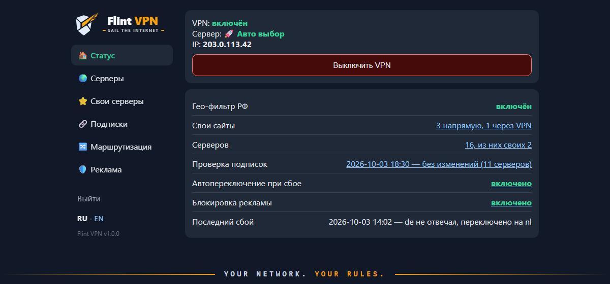

## О проекте

Flint VPN превращает роутер GL.iNet в прозрачный VPN-шлюз. Все устройства, подключённые к его Wi‑Fi или LAN, — телефоны, ноутбуки, телевизоры, приставки — ходят в интернет через Xray (VLESS + REALITY) без каких-либо настроек и приложений на самих устройствах. Российские сайты при этом могут идти напрямую.

> [!NOTE]
> **Проверено на GL.iNet GL-BE6500 (Flint 3e)**, прошивка GL 4.x (OpenWrt 23.05), режим Repeater (роутер подключён к Wi‑Fi основного домашнего роутера).
>
> Сборка делалась для личного использования, под свой роутер. По идее она должна работать и на других устройствах с OpenWrt (прежде всего aarch64), но там она не проверялась — см. [Другие роутеры на OpenWrt](#другие-роутеры-на-openwrt).

**Почему появилась своя веб-панель.** Готовое решение с GitHub, которым я пользовался, на этом роутере просто отказалось запускаться. Поэтому настройка Xray, переключение серверов и всё остальное здесь сделаны своими силами: набор shell-скриптов и лёгкая CGI-панель, которая работает на штатном `uhttpd` без Node.js, Python и прочих тяжёлых зависимостей на роутере.

## Возможности

- **Прозрачный VPN для всей сети.** TCP-трафик клиентов перенаправляется в Xray; на устройствах ничего настраивать не нужно.
- **Гео-фильтр РФ.** Российские сайты (`geosite:category-ru`) и IP (`geoip:ru`) идут напрямую, остальное — через VPN. Выключается одной кнопкой (всё через VPN).
- **Свои правила.** Сайты, IP и подсети «всегда напрямую» или «всегда через VPN» — важнее гео-фильтра.
- **Веб-панель** `http://vpn.lan:81/` по PIN: выбор сервера, включение и выключение VPN, маршрутизация, свои серверы, подписки, блокировка рекламы, смена PIN, экспорт и импорт настроек. Работает и с телефона. Русский и английский интерфейс: язык выбирается по браузеру, переключатель RU | EN в правом верхнем углу.
- **Подписки любых провайдеров.** Можно подключить несколько подписок в формате v2rayN / Happ / Hiddify — серверы всех появятся в панели, сгруппированные по провайдеру. Название, срок действия и трафик подписки подтягиваются сами. Список обновляется кнопкой или автоматически (от каждых 30 минут до раза в сутки); подписки роутер скачивает напрямую, так что обновление работает, даже когда текущий сервер лёг.
- **Свои серверы.** Добавление по ссылке `vless://`, копией сервера из подписки или вручную; транспорт TCP (xtls-rprx-vision) или gRPC.
- **Автопереключение при сбое.** Каждые 2 минуты роутер проверяет VPN; если сервер перестал отвечать, а интернет есть, обновляет подписку и переходит на первый рабочий сервер.
- **Белые списки.** Серверы провайдера с голым IP-адресом (для сетей, где открыт только белый список) собраны в отдельный свёрнутый блок.
- **Зашифрованный DNS** (dnscrypt-proxy) — против подмены DNS провайдером; DNS-запросы клиентов принудительно идут через роутер. В панели три режима, у каждого свой сервер:
  - **DoH** (по умолчанию): Cloudflare, Google, Quad9, AdGuard DNS или свой адрес `https://…`;
  - **DNSCrypt** — запасной вариант, если в сети блокируют DoH: AdGuard, Quad9, dnscry.pt или свой stamp `sdns://…`;
  - **обычный UDP**: Cloudflare, Google, Quad9, AdGuard, Яндекс, DNS основного роутера или свои IP.
- **Блокировка рекламы** для всей сети на уровне DNS — AdGuard Home из прошивки GL, включается кнопкой. По умолчанию — AdGuard DNS filter, DNS-версия фильтров платного AdGuard; можно добавить свои списки по ссылке и свои правила. Списки обновляются сами, отдельные устройства и сайты можно исключить, а недавно заблокированные домены разрешить одной кнопкой.
- **Доступ к домашней сети.** Сеть основного роутера, NAS, принтер доступны напрямую, без VPN; локальные имена (`nas01`) задаются в панели.
- **Бэкап и восстановление** одной командой, повторный деплой не теряет настройки из панели. Настройки панели можно скачать файлом и загрузить на этот же или другой Flint прямо из браузера.

## Скриншоты

| Вход | Статус |
|---|---|
| 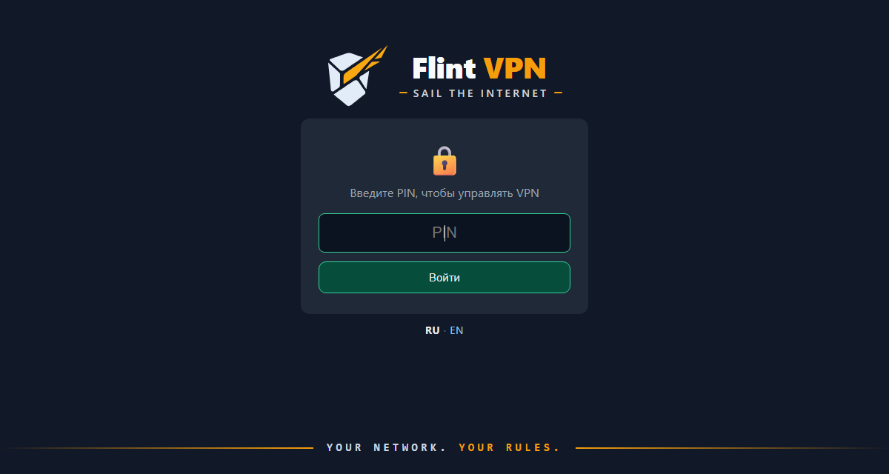 |  |
| **Подписки** | **Серверы** |
| 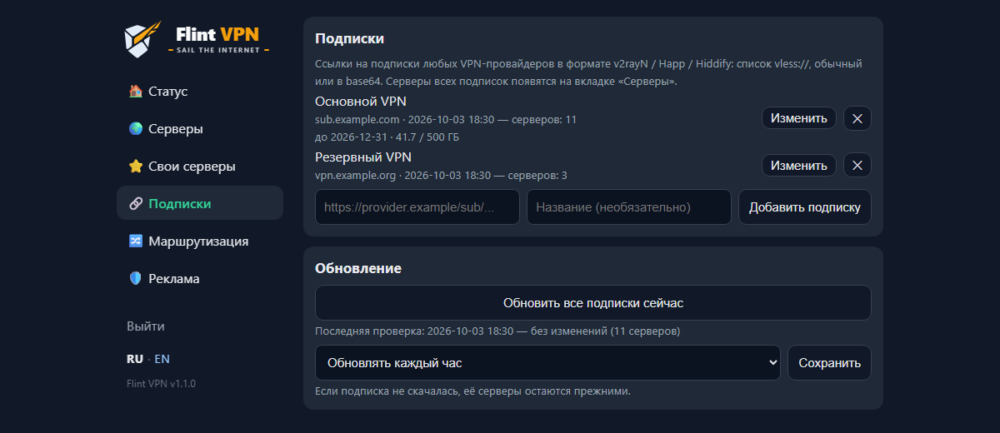 | 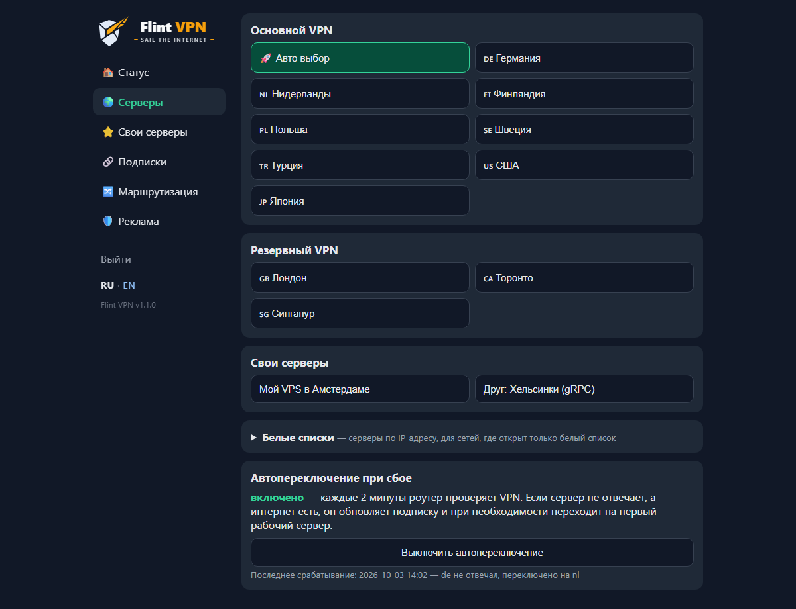 |
| **Белые списки** | **Свои серверы** |
| 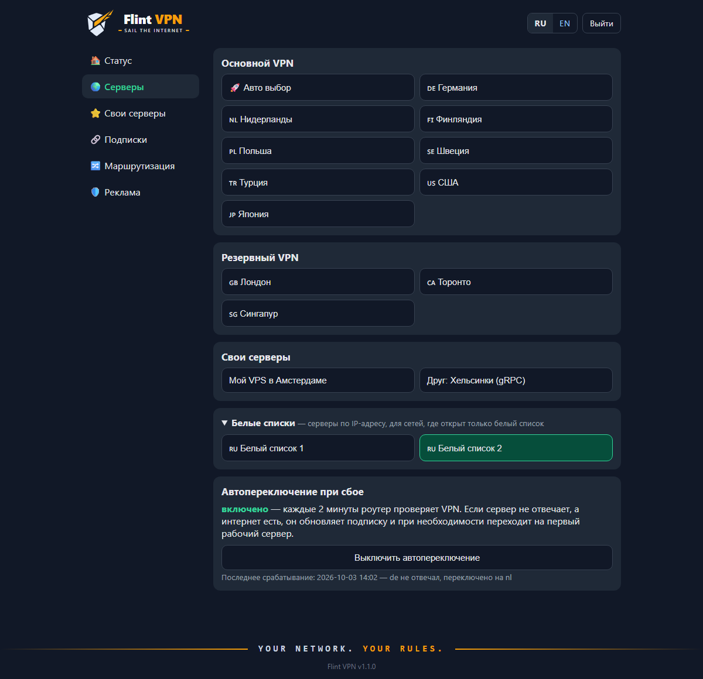 | 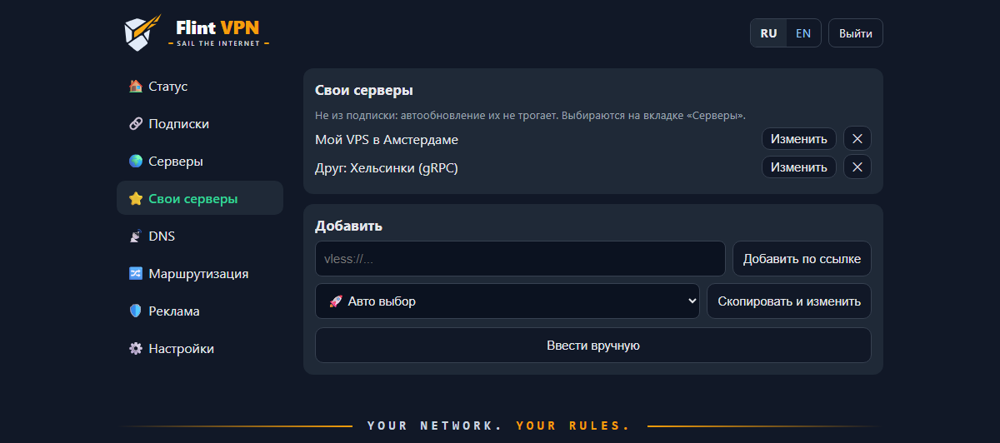 |
| **Редактирование сервера** | **DNS** |
| 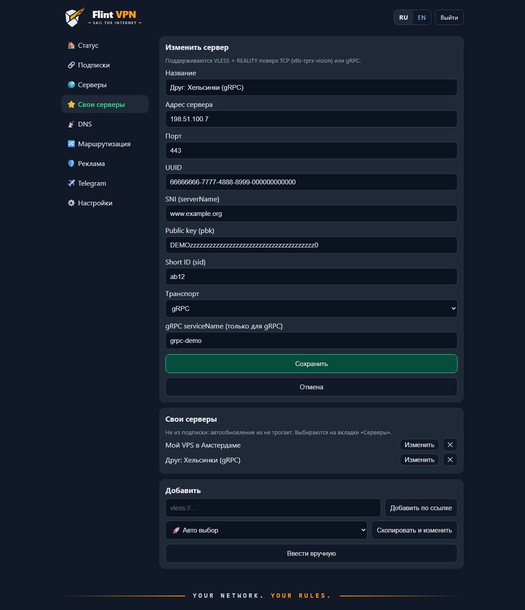 | 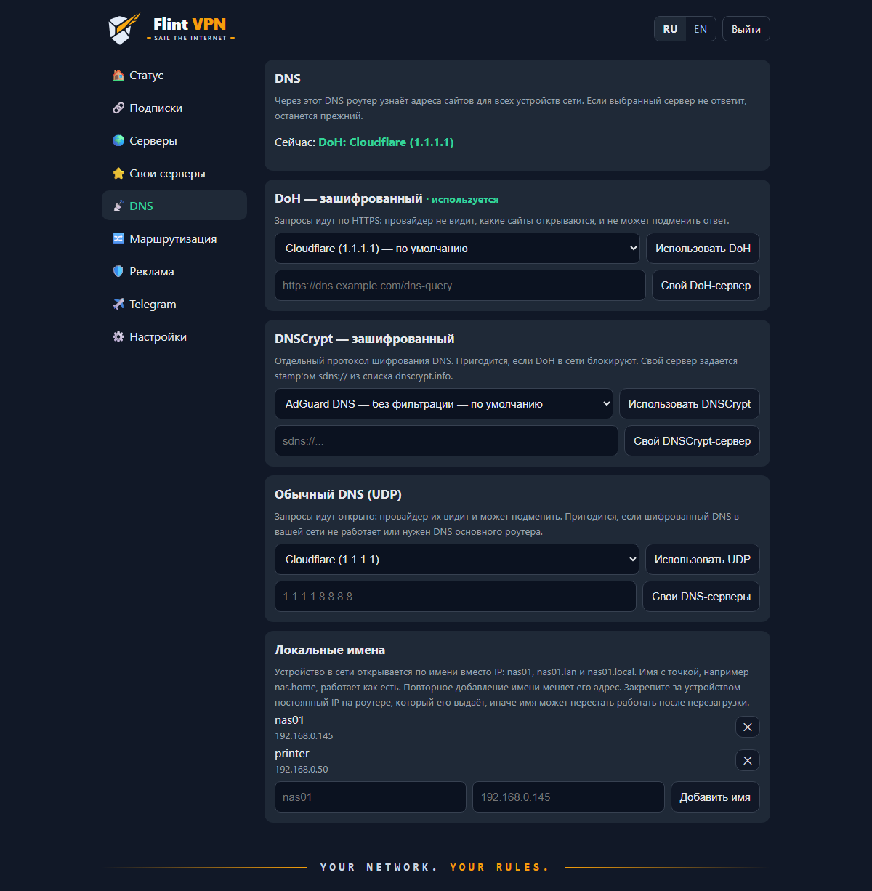 |
| **Маршрутизация** | **Блокировка рекламы** |
| 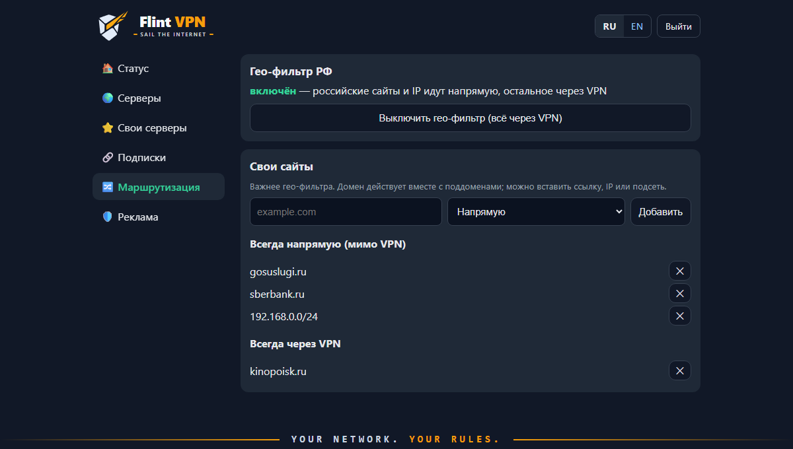 | 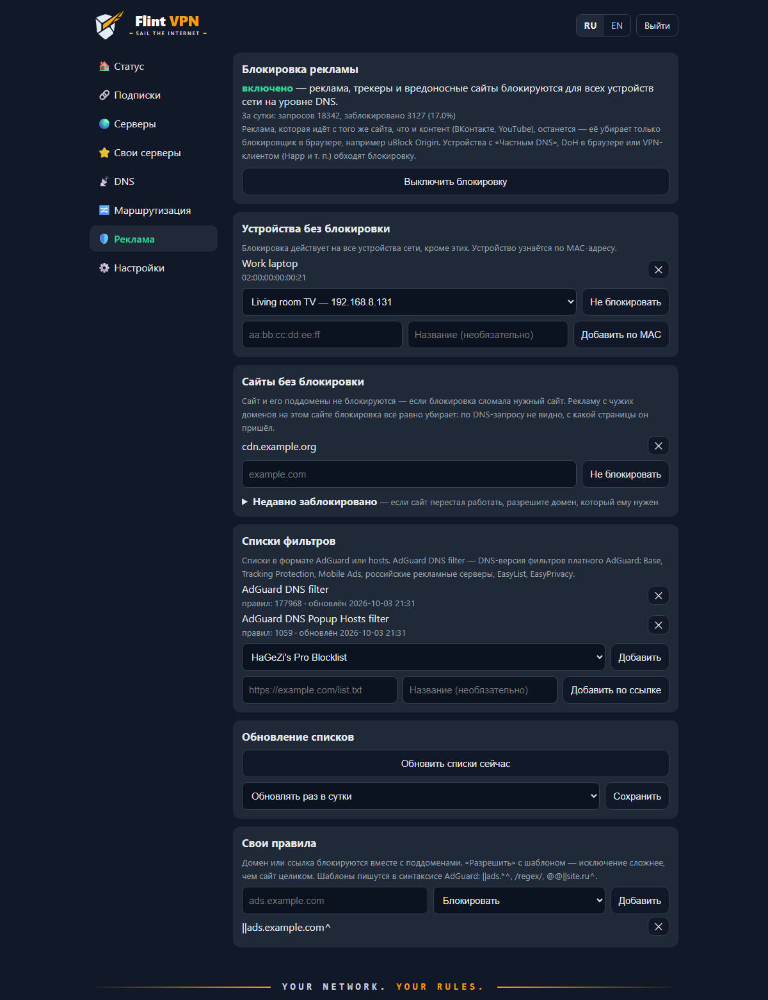 |
| **Настройки** | **Телефон** |
| 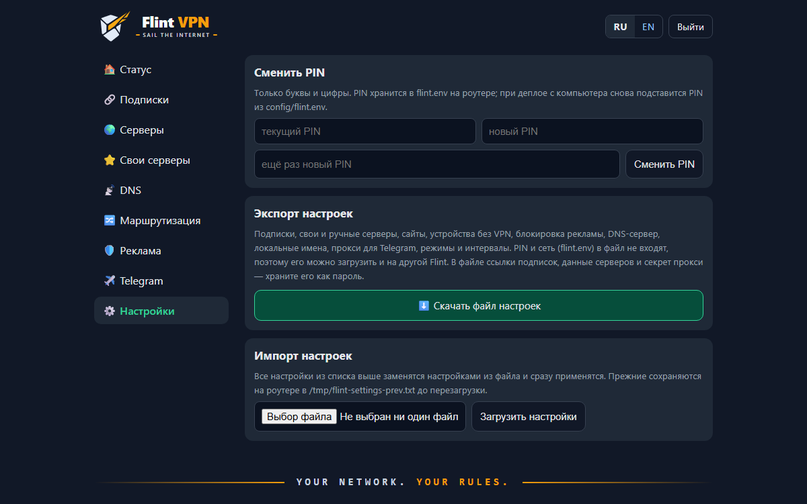 | 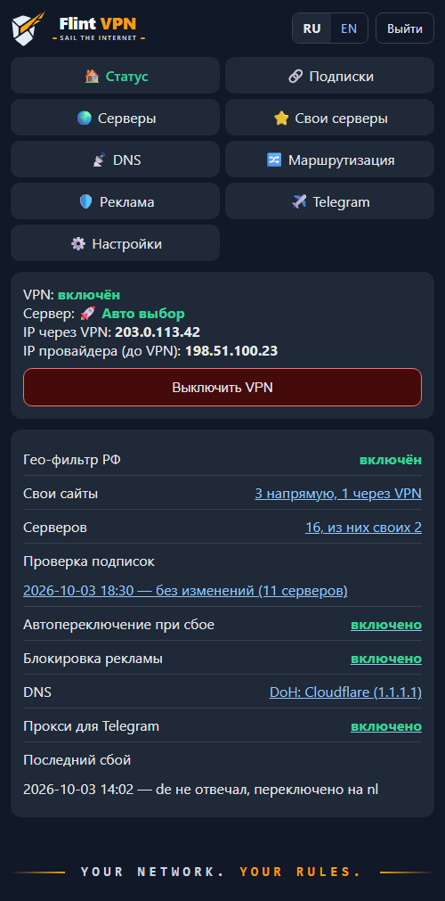 |
| **Телефон: серверы** | **Без серверов** |
| 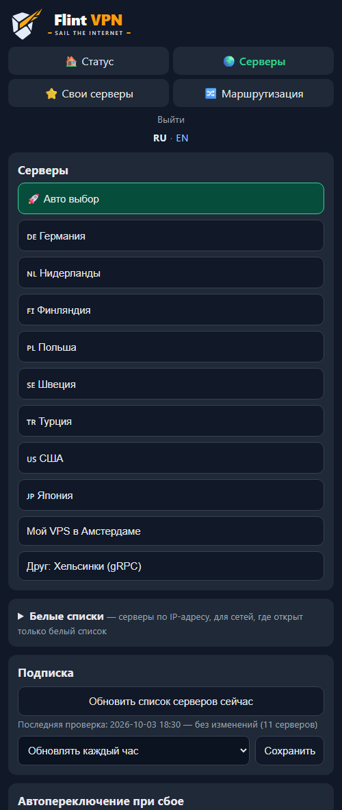 | 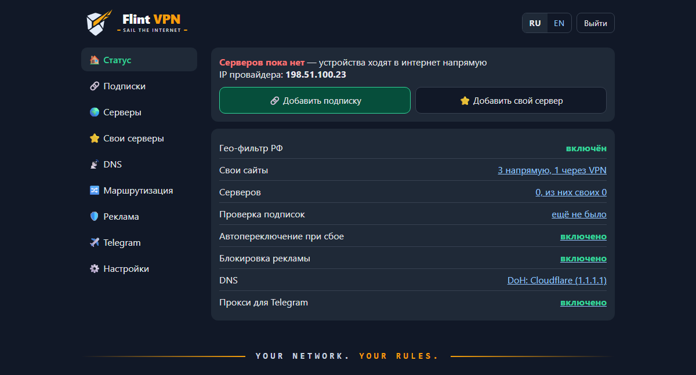 |

На скриншотах демо-данные: адреса из документационных диапазонов, выдуманные серверы и ключи.

## Как это работает

```
 Телефон / ноутбук / ТВ
          │  Wi-Fi или LAN, без настроек
          ▼
 ┌──────────────── Flint (OpenWrt) ────────────────┐
 │ DNS: [AdGuard Home] ──► dnsmasq ──► DoH         │
 │ iptables: TCP из br-lan ──► Xray :12345         │
 │ Xray: РФ и свои «напрямую» ──► direct           │
 │       остальное ──► VLESS + REALITY             │
 │ uhttpd :81 ──► веб-панель (CGI)                 │
 └─────────────────────────────────────────────────┘
          │
          ▼
 Основной роутер ──► интернет
```

- Правила `iptables` (через `/etc/firewall.user`) отправляют TCP-трафик клиентов из `br-lan` в `dokodemo-door` Xray. Локальные и частные сети, а также адреса VPN-серверов идут мимо.
- DNS-запросы устройств принудительно идут на роутер. При включённой блокировке рекламы они сначала попадают в AdGuard Home, иначе — сразу в dnsmasq; дальше — в dnscrypt-proxy (DoH или DNSCrypt) или, в режиме UDP, напрямую на выбранные DNS-серверы.
- QUIC (UDP 443) блокируется, чтобы браузеры и приложения перешли на TCP и попали в туннель. Остальной UDP идёт напрямую.
- Конфиг Xray собирается из шаблона `/etc/xray/template.json` скриптом `flint-node`: выбранный сервер, гео-фильтр, свои сайты. Перед применением конфиг проверяется `xray -test`, после — проверяется IP выхода.
- Собственный трафик роутера (обновление подписки, пакетов) идёт напрямую.

## Требования

**Роутер**
- GL.iNet на прошивке 4.x (OpenWrt 22.03+ с fw4) или другой роутер с OpenWrt — см. [ниже](#другие-роутеры-на-openwrt);
- архитектура **aarch64** (установщик проверяет это);
- доступ в интернет на этапе установки (ставятся пакеты из `opkg`) и ~60 МБ свободного места: Xray около 27 МБ, базы geoip/geosite около 25 МБ;
- SSH-доступ под `root` (на GL.iNet включён по умолчанию, пароль — как от админки).

**VPN**
- подписка провайдера со ссылками `vless://` (VLESS + REALITY), как для Happ, v2rayN, Hiddify, или свой сервер VLESS + REALITY.

**Компьютер для установки**
- Windows 10/11 с PowerShell и встроенным OpenSSH, **или** macOS / Linux с `ssh` и `tar`.

## Быстрый старт

### 1. Скачать проект

```sh
git clone https://github.com/AndreyTokarev/Flint_Vless.git
cd Flint_Vless
```

Или скачайте ZIP: зелёная кнопка **Code → Download ZIP** на GitHub, затем распакуйте.

### 2. Подготовить роутер

1. Откройте админку GL.iNet: `http://192.168.8.1`, задайте пароль администратора.
2. Подключите роутер к интернету. Проверено в режиме **Repeater**: *Internet → Repeater* → выберите Wi‑Fi основного роутера. Подойдёт и кабель в WAN — тогда в настройках ниже укажите `UPSTREAM_IF=wan`.
3. Убедитесь, что интернет на роутере работает (в админке статус подключения зелёный).
4. Если роутер раньше сбрасывался и вы уже заходили на него по SSH, удалите старый ключ хоста:
   ```sh
   ssh-keygen -R 192.168.8.1
   ```

### 3. Добавить SSH-ключ (желательно)

Без ключа пароль `root` придётся вводить несколько раз за деплой.

```powershell
# Windows (PowerShell). Если ключа нет: ssh-keygen -t ed25519
Get-Content "$HOME\.ssh\id_ed25519.pub" | ssh root@192.168.8.1 "cat >> /etc/dropbear/authorized_keys && chmod 600 /etc/dropbear/authorized_keys"
```

```sh
# macOS / Linux
cat ~/.ssh/id_*.pub | ssh root@192.168.8.1 "cat >> /etc/dropbear/authorized_keys && chmod 600 /etc/dropbear/authorized_keys"
```

Проверка: `ssh root@192.168.8.1 echo ok` должно вывести `ok` без запроса пароля.

### 4. Заполнить `config/flint.env`

Скопируйте образец и откройте его в любом редакторе:

```powershell
Copy-Item config\flint.env.example config\flint.env     # Windows
```
```sh
cp config/flint.env.example config/flint.env              # macOS / Linux
```

Минимально нужно заполнить:

| Параметр | Что указать |
|---|---|
| `UI_PIN` | PIN для входа в панель (буквы и цифры) |
| `SUB_URL` | ссылка на подписку (та же, что вы добавляете в Happ / v2rayN). Можно оставить пустой и добавить подписку потом в панели |
| `UPSTREAM_IF` | `sta1` — роутер подключён к Wi‑Fi (Repeater), `wan` — кабелем |
| `UPSTREAM_NET` | сеть основного роутера, например `192.168.0.0/24` или `192.168.1.0/24` |

Остальные параметры описаны в разделе [Настройки](#настройки-configflintenv). Файл `config/flint.env` в git не попадает.

### 5. Задать серверы вручную `config/nodes.conf` (необязательно)

Обычно этот шаг не нужен. Если задан `SUB_URL`, роутер скачает серверы подписки прямо во время установки и дальше будет сам обновлять список. Без серверов установка тоже проходит: устройства ходят в интернет напрямую, пока вы не добавите подписку на вкладке «Подписки» (или свой сервер на вкладке «Свои серверы»), после чего VPN включается сам.

Если подписки нет, а есть только ссылка на сервер, скопируйте `config/nodes.conf.example` в `config/nodes.conf` и впишите сервер из ссылки (или добавьте его после установки на вкладке «Свои серверы»):

```
vless://UUID@ADDRESS:PORT?type=tcp&security=reality&sni=SNI&pbk=PBK&sid=SID&flow=xtls-rprx-vision#NAME
```

```
# 🇳🇱 Нидерланды
nl  ADDRESS  SNI  PBK  SID  UUID  PORT
```

Строка-комментарий над сервером — его название в панели. Пустой `sid` пишется как `-`. Первым полем идёт короткий код (`nl`); после установки включается сервер с кодом `DEFAULT_NODE` из `flint.env`, а если такого нет — первый в списке. Подробнее — в разделе [Серверы](#серверы-confignodesconf).

### 6. Установить

Из корня проекта:

```powershell
.\deploy.ps1                       # Windows
.\deploy.ps1 -Router 192.168.8.1   # если у роутера другой адрес
```
```sh
./deploy.sh                        # macOS / Linux
./deploy.sh 192.168.8.1
```

> [!TIP]
> Если PowerShell пишет, что выполнение сценариев отключено, разрешите его для текущего окна:
> `Set-ExecutionPolicy -Scope Process Bypass`

Скрипт упакует комплект, зальёт его на роутер и запустит `install.sh`. Установка занимает несколько минут: ставятся пакеты, скачивается Xray и базы geoip/geosite (~25 МБ). В конце вы увидите:

```
DNS: ok
VPN exit IP: 203.0.113.42
Panel: http://vpn.lan:81/  (PIN from flint.env)
```

`VPN exit IP` — адрес VPN-сервера, а не ваш домашний. Если вместо него `VPN: FAIL` — см. [Решение проблем](#решение-проблем).

### 7. Открыть панель

Подключитесь к Wi‑Fi роутера и откройте **http://vpn.lan:81/** (или `http://192.168.8.1:81/`), введите PIN из `flint.env`. Проверить, что VPN работает, можно на любом сайте вроде [ifconfig.me](https://ifconfig.me): там должен быть адрес VPN-сервера.

Установку можно запускать повторно сколько угодно раз — например, после изменения `flint.env` или обновления проекта. Настройки, сделанные в панели (свои серверы, сайты, интервал обновления), сохраняются.

## Веб-панель

Адрес: **http://vpn.lan:81/** (порт 80 занят штатной админкой GL.iNet). Панель доступна только из локальной сети роутера и из сети основного роутера (`UPSTREAM_NET`).

| Вкладка | Что там |
|---|---|
| **Статус** | VPN включён или выключен (кнопка), текущий сервер, IP через VPN и IP провайдера (до VPN), гео-фильтр, число своих сайтов и серверов, когда проверялись подписки, автопереключение и последний сбой, блокировка рекламы, DNS-сервер |
| **Подписки** | подписки VPN-провайдеров: добавить по ссылке, изменить ссылку или название, удалить; когда обновлялась, сколько серверов, срок действия и трафик; «Обновить все подписки сейчас» и интервал автообновления |
| **Серверы** | выбор сервера одной кнопкой — серверы сгруппированы по подпискам, свои серверы отдельно; блок «Белые списки»; включение автопереключения при сбое |
| **Свои серверы** | серверы не из подписки: добавить по ссылке `vless://`, скопировать сервер из подписки и изменить копию, ввести вручную; изменить или удалить |
| **DNS** | режим DoH, DNSCrypt или обычный UDP и сервер для каждого — готовый или свой; используемый режим отмечен. Локальные имена устройств сети (`nas01` → IP) |
| **Маршрутизация** | гео-фильтр РФ (включить или выключить); устройства без VPN (по MAC); свои сайты, IP и подсети «всегда напрямую» или «всегда через VPN» |
| **Реклама** | блокировка рекламы (включить или выключить) и статистика за сутки; устройства без блокировки; сайты без блокировки и «Недавно заблокировано» с кнопкой «Разрешить»; списки фильтров — готовые и свои по ссылке; автообновление и «Обновить списки сейчас»; свои правила |
| **Настройки** | смена PIN; экспорт настроек в файл и импорт из файла (подписки, серверы, сайты, реклама, DNS, режимы; без PIN и сети) |

Язык панели — русский или английский. При первом входе он выбирается по языку браузера (или по `UI_LANG` в `flint.env`), потом его можно сменить переключателем **RU | EN** в правом верхнем углу (рядом с кнопкой «Выйти», на странице входа — там же); выбор запоминается в браузере. На этом же языке пишутся сообщения после действий в панели.

Как пользоваться:
- **Сменить сервер** — вкладка «Серверы», нажать на нужный. Роутер проверит конфиг и IP выхода; если сервер не отвечает, панель об этом скажет.
- **Выключить VPN** — кнопка на вкладке «Статус». Устройства пойдут в интернет напрямую; выбранный DNS и доступ к домашней сети остаются.
- **Сайт не открывается через VPN** (банк, госуслуги) — добавьте его на вкладке «Маршрутизация» как «Напрямую». Можно вставить ссылку целиком, домен действует вместе с поддоменами.
- **Сайт должен идти через VPN, хотя он российский** — добавьте его как «Через VPN».
- **Провайдер обновил серверы** — «Подписки → Обновить все подписки сейчас». Это работает и при включённом VPN, даже если текущий сервер не отвечает.
- **Подключить ещё одного провайдера** — «Подписки», вставьте ссылку подписки (ту же, что в Happ) и нажмите «Добавить подписку». Провайдер выдал новую ссылку — «Изменить» у этой подписки.
- **Подключиться к своему VPS** — «Свои серверы → Добавить по ссылке» и вставьте `vless://...`.
- **Пустить устройство мимо VPN** (телевизор, консоль, рабочий ноутбук) — «Маршрутизация → Устройства без VPN»: выберите устройство из списка или впишите его MAC. Остальные устройства по-прежнему идут через VPN.
- **Убрать рекламу** — «Реклама → Включить блокировку».
- **Сайт сломался из-за блокировки** — «Реклама → Сайты без блокировки»: впишите сайт или откройте «Недавно заблокировано» и нажмите «Разрешить» у нужного домена. Если мешает устройству целиком — внесите его в «Устройства без блокировки».
- **Сменить DNS** — вкладка «DNS». Три режима:
  - **DoH** (по умолчанию) — зашифрованный DNS по HTTPS: Cloudflare, Google, Quad9, AdGuard DNS или свой адрес `https://dns.example.com/dns-query`;
  - **DNSCrypt** — другой протокол шифрования, запасной вариант, если DoH в сети блокируют: AdGuard DNS, Quad9, dnscry.pt (Москва, Стокгольм) или свой stamp `sdns://…` из списка [dnscrypt.info](https://dnscrypt.info/public-servers);
  - **Обычный (UDP)** — открытый DNS, провайдер видит запросы: Cloudflare, Google, Quad9, AdGuard DNS, Яндекс, DNS основного роутера или свои IP.

  У каждого режима свой сервер, переключение режима его не сбрасывает. Роутер проверяет новый DNS и, если тот не ответил, оставляет прежний.
- **Открывать NAS или принтер по имени** — «DNS → Локальные имена»: имя (`nas01`) и IP устройства. Работают `nas01`, `nas01.lan` и `nas01.local`; имя с точкой (`nas.home`) — как есть. Повторное добавление имени меняет адрес.
- **Сменить PIN** — «Настройки → Сменить PIN». Новый PIN действует сразу; чтобы повторный деплой его не вернул, впишите его в `config/flint.env` или сделайте бэкап. Забыли PIN и не можете войти — его можно задать по SSH, см. [Решение проблем](#решение-проблем).
- **Перенести настройки** на другой Flint или сохранить перед экспериментом — «Настройки → Скачать файл настроек», затем «Загрузить настройки» на нужном роутере. PIN и сеть (`flint.env`) в файл не входят.

## Настройки `config/flint.env`

| Параметр | Описание |
|---|---|
| `VLESS_UUID` | необязательно: UUID для строк `config/nodes.conf`, где он не указан (у серверов из подписок и своих серверов UUID свой) |
| `UI_PIN` | PIN панели (только буквы и цифры). Меняется и в панели («Настройки»), но деплой записывает на роутер значение отсюда — после смены в панели обновите его здесь или сделайте бэкап |
| `UI_TITLE` | надпись в логотипе панели, по умолчанию `Flint VPN` (последнее слово — золотым) |
| `UI_TAGLINE` | подзаголовок под логотипом, по умолчанию `Sail the internet`; пустое значение убирает его |
| `UI_LANG` | язык панели по умолчанию: `ru` или `en`; пусто — по языку браузера. Им же пишутся фоновые записи (последняя проверка подписки, последний сбой) |
| `DEFAULT_NODE` | код сервера, который включается после установки (обычно `auto`); если такого нет — первый в списке |
| `ROUTING` | `ru` — российские сайты и IP напрямую, остальное через VPN; `global` — всё через VPN. Базы `geoip.dat`/`geosite.dat` (Loyalsoldier) скачиваются при установке и обновляются по воскресеньям в 4:30; без них роутер работает в режиме `global`. Задаёт режим только на новом роутере, дальше он переключается в панели |
| `UPSTREAM_IF` | интерфейс основного роутера: `sta1` (Wi‑Fi, Repeater) или `wan` (кабель) |
| `UPSTREAM_NET` | сеть основного роутера; она доступна устройствам за Flint напрямую, без VPN, и из неё доступен сам Flint |
| `LOCAL_HOSTS` | начальный список локальных имён: `"nas01=192.168.0.145 printer=192.168.0.50"` — будут работать `nas01`, `nas01.lan`, `nas01.local`. Действует только на новом роутере, дальше имена меняются в панели («DNS → Локальные имена») |
| `SUB_URL` | необязательно: первая подписка на новом роутере; остальные добавляются на вкладке «Подписки» (см. [Подписки](#подписки)) |
| `SUB_INTERVAL` | интервал автообновления для нового роутера: `off`, `30m`, `1h`, `3h`, `6h`, `12h`, `24h` (по умолчанию `24h`); дальше меняется в панели и переживает повторный деплой |
| `SUB_GRPC` | `1` — брать из подписки и gRPC-серверы (по умолчанию пропускаются, см. [Ограничения](#ограничения)) |
| `ADBLOCK` | `on` — включить блокировку рекламы на новом роутере; дальше она включается и выключается в панели, выбор переживает повторный деплой |
| `XRAY_VERSION` | релиз Xray для загрузки с GitHub, если пакета `xray-core` нет в `opkg` (по умолчанию `v1.8.24`) |

## Серверы `config/nodes.conf`

Серверы подписок роутер собирает сам (`flint-sub-update`, см. [Подписки](#подписки)). В `config/nodes.conf` пишутся только серверы, заданные вручную; если файл есть, деплой заливает его на роутер, иначе там остаётся прежний.

Из подписок берутся серверы VLESS + REALITY поверх TCP (xtls-rprx-vision), включая серверы с голым IP — в панели они попадают в блок «Белые списки». gRPC — только с `SUB_GRPC=1`. Служебные «серверы»-объявления провайдера (название начинается с ❗) пропускаются.

Формат строки:

```
код  адрес  sni  pbk  sid  [uuid]  [порт]  [tcp|grpc]  [serviceName]
```

Пустое поле — `-`; `uuid` по умолчанию берётся из `VLESS_UUID`, порт — `443`, транспорт — `tcp`. Строка-комментарий над сервером — его название в панели; флаг-эмодзи в начале названия превращается в код страны.

**Свои серверы** (добавленные в панели) хранятся на роутере отдельно, в `/etc/xray/nodes-custom.conf`, с кодами `my1`, `my2`… Обновление подписки их не трогает. Сервер из подписки нельзя править напрямую (следующее обновление затрёт правку), но его можно скопировать в свои и изменить копию.

## Подписки

Подписок может быть несколько, от разных провайдеров: они добавляются, меняются и удаляются на вкладке «Подписки» или командами `flint-sub-update`. Подходит обычная ссылка подписки из Happ, v2rayN или Hiddify — список ссылок `vless://` (как есть или в base64). При первом запуске в список попадает `SUB_URL` из `flint.env`.

- Подписка добавляется, только если скачалась и в ней есть поддерживаемые серверы (VLESS + REALITY).
- Серверы каждой подписки лежат в `/etc/xray/nodes.d/<id>.conf`, свои — в `nodes-custom.conf`, заданные вручную — в `nodes.conf`. Если коды совпали, второй сервер получает номер: `de`, `de2`.
- Если при обновлении подписка не скачалась, её серверы остаются прежними, а в панели видна ошибка.
- Название подписки по умолчанию берётся из заголовка `profile-title`, срок действия и трафик — из `subscription-userinfo` (их отдают большинство провайдеров для Happ).
- Сайты всех подписок идут мимо VPN, чтобы обновление работало, даже когда текущий сервер не отвечает.
- Список подписок хранится в `/etc/xray/subscriptions` (ссылка с токеном — секрет); бэкап кладёт его в `config/subscriptions`.
- Подписок может не быть совсем, например сразу после установки без `SUB_URL` или после удаления последней. Если нет и своих серверов, Xray не запускается и устройства ходят в интернет напрямую; на вкладке «Статус» это видно. Первая добавленная подписка или свой сервер включает VPN сам.

## Автопереключение при сбое

`flint-watchdog` запускается cron каждые 2 минуты:
1. проверяет туннель (запрос через Xray к `generate_204`);
2. если туннель не работает — ждёт 10 секунд и проверяет ещё раз;
3. если интернет напрямую есть (значит, дело в сервере, а не в провайдере), обновляет подписку и проверяет снова;
4. если текущий сервер всё ещё не отвечает, по очереди пробует остальные и остаётся на первом рабочем; если не работает ни один, возвращает исходный.

Результат последнего срабатывания виден в панели и в `/etc/xray/watchdog-last`. Выключается в панели или командой `flint-watchdog off`. При выключенном VPN watchdog ничего не делает.

## Блокировка рекламы

Работает на уровне DNS для всех устройств сети, без приложений на самих устройствах. Используется AdGuard Home, который уже есть в прошивке GL.iNet 4.x (`/usr/bin/AdGuardHome`): проект запускает свой экземпляр на `127.0.0.1:5054`. Штатный AdGuard Home из админки GL остаётся выключенным — не включайте его одновременно с этим.

Как устроено:
- при включённой блокировке firewall (цепочка `FLINT_DNS`) отправляет DNS-запросы устройств в AdGuard Home, а тот — дальше в dnsmasq, поэтому локальные имена и DoH работают как раньше;
- устройства из «Устройств без блокировки» (по MAC-адресу) ходят в dnsmasq напрямую;
- каждые 2 минуты cron проверяет, что AdGuard Home отвечает. Если нет — перезапускает его, а если не помогло, пускает DNS мимо него, пока он не поднимется. Интернет из-за блокировщика не пропадёт;
- веб-интерфейс AdGuard Home наружу не открыт (только `127.0.0.1`), всё управление — из панели.

**Списки.** По умолчанию — [AdGuard DNS filter](https://github.com/AdguardTeam/AdGuardSDNSFilter): DNS-версия фильтров из платных продуктов AdGuard (Base, Tracking Protection, Mobile Ads, российские и другие региональные рекламные серверы, EasyList, EasyPrivacy). Он бесплатный и открытый. В панели можно добавить готовые списки из [реестра AdGuard](https://github.com/AdguardTeam/HostlistsRegistry) (Popup Hosts, HaGeZi Pro, OISD, Steven Black, защита от фишинга и вредоносных сайтов) или любой свой по ссылке — в формате AdGuard/Adblock или hosts. Чем больше списков, тем больше ложных срабатываний, так что начинайте с одного.

**Обновление.** Списки обновляются автоматически — по умолчанию раз в сутки, интервал от часа до недели или выключено — и по кнопке «Обновить списки сейчас».

**Свои правила:**

| Что ввести | Что получится |
|---|---|
| `ads.example.com` или ссылка, «Блокировать» | домен блокируется вместе с поддоменами (`\|\|ads.example.com^`) |
| то же, «Разрешить» | исключение (`@@\|\|ads.example.com^`), если список заблокировал нужный сайт |
| `\|\|ads.*^`, `/^ad[0-9]+\./`, `@@\|\|site.ru^` | правило в [синтаксисе AdGuard](https://adguard-dns.io/kb/general/dns-filtering-syntax/) как есть |

Правила начинают действовать через несколько секунд.

**Сайты без блокировки.** Если блокировка сломала нужный сайт, впишите его в «Сайты без блокировки» — это то же правило «Разрешить» для домена с поддоменами, но отдельным списком. Ниже — «Недавно заблокировано»: последние заблокированные домены с именем устройства, у каждого кнопка «Разрешить». Журнал запросов хранится только в памяти (последние 1000), на флеш ничего не пишется.

AdGuard Home занимает 40–60 МБ памяти; при выключенной блокировке он остановлен.

### Где реклама останется

DNS-блокировка видит только имена сайтов, к которым обращается устройство, но не содержимое страниц. Отсюда ограничения:

- **Реклама с того же домена, что и контент, остаётся.** ВКонтакте (рекламные блоки в ленте и в левой колонке), YouTube (ролики перед видео и внутри них), Instagram, Facebook, поиск и Дзен Яндекса отдают рекламу со своих же серверов вместе с лентой, а картинки к ней — с тех же адресов, что и фото в постах. Заблокировать такую рекламу по DNS можно только вместе с самим сайтом. Поэтому правило «Блокировать» для `vk.com` или `youtube.com` не поможет, а только сломает сайт.
- **Элементы страницы не скрываются.** На месте заблокированного баннера может остаться пустая рамка или заглушка.
- **Реклама внутри приложений** (YouTube на телевизоре, приложения соцсетей на телефоне) убирается только частично, по той же причине.

На таких сайтах помогает только блокировщик на самом устройстве: в браузере на компьютере — расширение [uBlock Origin](https://ublockorigin.com/), на Android — Firefox с uBlock Origin. Оно прячет рекламные блоки прямо на странице и хорошо дополняет блокировку на роутере: роутер закрывает рекламные и трекерные домены на всех устройствах, включая телевизоры и приложения, а расширение — то, что идёт с самого сайта.

**Кто обходит блокировку.** Устройства, чьи DNS-запросы идут мимо роутера:
- Android с включённым «Частным DNS»;
- браузеры с «безопасным DNS» (DoH): Chrome, Edge, Firefox, Яндекс Браузер;
- устройства с включённым VPN-клиентом (Happ, v2rayN, Hiddify и т. п.): DNS и весь трафик уходят в его туннель, поэтому не работают ни блокировка, ни VPN роутера. За Flint VPN-клиент не нужен — выключите его.

Подробнее о настройке устройств — в разделе [Устройства в сети](#устройства-в-сети). Если после включения блокировки сломался нужный сайт, впишите его в «Сайты без блокировки» или добавьте устройство в «Устройства без блокировки».

## Доступ к Flint из сети основного роутера

`install.sh` разрешает на Flint входящие соединения из `UPSTREAM_NET` — к самому роутеру и к устройствам за ним (`192.168.8.x`). Если сеть основного роутера сменилась, поправьте `UPSTREAM_IF` / `UPSTREAM_NET` в `config/flint.env` и повторите деплой. Чтобы с компьютера в сети основного роутера открывать панель Flint и устройства за ним, настройте основной роутер (пример для TP-Link, `http://192.168.0.1`):

1. **Резервирование DHCP** для Flint (его MAC в режиме репитера), например `192.168.0.111`, чтобы адрес не менялся.
2. **Статический маршрут:** сеть `192.168.8.0`, маска `255.255.255.0`, шлюз `192.168.0.111`.

Устройствам основной сети, к которым ходите через Flint (NAS, принтер), тоже закрепите адреса — резервированием DHCP на основном роутере или вручную на самом устройстве. Иначе после перезагрузки устройство может получить другой адрес, и его локальное имя будет указывать в пустоту.

После этого Flint доступен из сети основного роутера как `192.168.0.111` и как `192.168.8.1`. Если на компьютере включён VPN-клиент (Happ и т. п.), он может забирать `192.168.8.x` в туннель — тогда добавьте маршрут на самом компьютере:

```powershell
route -p add 192.168.8.0 mask 255.255.255.0 192.168.0.111   # Windows, от администратора
```

## Резервная копия

```powershell
.\backup.ps1              # конфиги роутера -> backup\<дата>\router-config.tar.gz, обновляет config\
.\backup.ps1 -WithBinary  # плюс backup\bin\xray (~27 МБ) — пригодится, если opkg недоступен
```
```sh
./backup.sh
./backup.sh --with-binary
```

Бэкап забирает с роутера настройки, свои серверы и сайты из панели, конфиги сети и Wi‑Fi. Пользовательские файлы из списка `kit/state-files` (`flint.env`, серверы, подписки, сайты, файлы блокировки рекламы) сохраняются одним архивом `backup\<дата>\state.tar.gz` и заодно кладутся в `config/` — их же потом заливает деплой. В том числе `flint.env` с PIN, если его меняли в панели.

Без компьютера настройки панели можно сохранить файлом: «Настройки → Скачать файл настроек» (или `flint-settings export` на роутере). Это не полный бэкап: в файл не входят `flint.env`, сеть и Wi‑Fi.

> [!WARNING]
> Папка `backup/` и файлы в `config/` содержат UUID подписки и пароли Wi‑Fi. В git они не попадают (`.gitignore`); храните их отдельно — в облаке или на флешке.

## Восстановление из бэкапа

```powershell
.\restore.ps1                                   # последний backup\<дата>
.\restore.ps1 -Backup backup\2026-10-03_1557    # конкретный
.\restore.ps1 -Full                             # плюс сеть, Wi-Fi, firewall, DHCP, SSH-ключи и перезагрузка
```
```sh
./restore.sh
./restore.sh backup/2026-10-03_1557
./restore.sh --full
```

По умолчанию `flint.env`, серверы, подписки, свои серверы и сайты, списки, правила и исключения блокировки рекламы из бэкапа кладутся в `config/`, затем запускается обычный деплой, а после него на роутер возвращаются все настройки панели из бэкапа: выбранный сервер, режимы VPN и маршрутизации, DNS, локальные имена, блокировка рекламы, интервалы и сторож. Подходит и для сброшенного роутера: сначала подключите его к интернету в админке GL. Текущие файлы `config/` перед заменой сохраняются в `backup/config-before-restore-<время>/`.

`-Full` / `--full` — только для **того же** роутера: вернёт его сеть, Wi‑Fi (SSID и пароли), firewall, DHCP-резервирования, cron и ключи SSH, затем перезагрузит. Скрипт спрашивает подтверждение (`-Yes` / `--yes` — без вопроса).

### Если opkg недоступен

`install.sh` сам ставит нужные пакеты: `curl`, `ca-bundle`, `dnscrypt-proxy2`, `unzip`, `xray-core` (лог — `/tmp/flint-opkg.log`). На GL.iNet он заодно чинит список архитектур в `/etc/opkg.conf`: фид GL собирает `xray-core` под `aarch64_cortex-a53`, а прошивка объявляет `aarch64_cortex-a53_neon-vfpv4`.

Если `xray-core` из `opkg` не встал, Xray берётся по порядку:
1. `backup/bin/xray` — сохраните заранее с рабочего роутера: `.\backup.ps1 -WithBinary`;
2. официальный релиз с GitHub (`XRAY_VERSION`).

## Удаление

```powershell
.\uninstall.ps1               # бэкап, затем удаление
.\uninstall.ps1 -KeepXray     # оставить пакет xray-core
.\uninstall.ps1 -NoBackup     # без бэкапа
```
```sh
./uninstall.sh
./uninstall.sh --keep-xray
./uninstall.sh --no-backup
```

Скрипт спрашивает подтверждение (`-Yes` / `--yes` — без вопроса), делает бэкап в `backup/<дата>` и удаляет с роутера всё, что поставил Flint VPN: панель, службы, скрипты `flint-*`, настройки в `/etc/xray`, свой AdGuard Home, правила firewall и задачи cron, пакет `xray-core` и базы geoip/geosite. Настройки DNS возвращаются к заводским: dnsmasq снова берёт DNS у основного роутера. Прошивка и её пакеты (`dnscrypt-proxy2`, `curl`, AdGuard Home из прошивки и т. д.), сеть, Wi‑Fi и пароль root не меняются.

После удаления устройства ходят в интернет напрямую. Из сети основного роутера Flint больше недоступен (это делали правила Flint VPN): подключайтесь к нему по Wi‑Fi или кабелем. Вернуть всё как было — `.\restore.ps1` / `./restore.sh` из сделанного бэкапа.

Удалить вручную, без компьютера с проектом: залейте на роутер `kit/uninstall.sh` и запустите `sh uninstall.sh` (или `sh uninstall.sh --keep-xray`).

## Команды на роутере

```sh
flint-node list                  # текущий сервер и коды
flint-node nl                    # переключиться на сервер nl (с проверкой IP выхода)
flint-node routing ru            # гео-фильтр: РФ напрямую (global — всё через VPN)
flint-node vpn off               # клиенты ходят в интернет напрямую (on — снова через VPN)
flint-node site add direct gosuslugi.ru   # свой сайт: direct — мимо VPN, proxy — через VPN
flint-node site list
flint-node site del gosuslugi.ru
flint-node direct add aa:bb:cc:dd:ee:ff TV   # устройство без VPN; список: flint-node direct, убрать: direct del <MAC>
flint-custom link 'vless://...'  # добавить свой сервер по ссылке
flint-custom list
flint-custom del my1
flint-sub-update                 # обновить все подписки
flint-sub-update list            # подписки: id, название, сайт, последнее обновление, срок и трафик
flint-sub-update add 'https://...' "Название"   # добавить подписку
flint-sub-update set s2 'https://...'          # новая ссылка (или название) подписки s2
flint-sub-update del s2          # удалить подписку и её серверы
flint-sub-update interval 1h     # автообновление: off, 30m, 1h, 3h, 6h, 12h, 24h
flint-watchdog off               # выключить автопереключение (on — включить)
cat /etc/xray/watchdog-last    # последнее срабатывание
flint-geo-update                 # обновить geoip/geosite вручную
flint-adblock on                 # блокировка рекламы (off — выключить)
flint-adblock list               # списки: ссылка, название, правил, когда обновлён
flint-adblock list add https://example.com/list.txt "Название"
flint-adblock rule add block ads.example.com   # allow — исключение
flint-adblock blocked                          # недавно заблокированные домены и устройства
flint-adblock exclude add aa:bb:cc:dd:ee:ff    # устройство без блокировки
flint-adblock refresh            # обновить списки сейчас
flint-adblock interval 24        # автообновление: off, 1, 12, 24, 72, 168 часов
flint-settings export > /tmp/s.txt   # экспорт настроек панели (без flint.env)
flint-settings import /tmp/s.txt     # импорт: заменяет настройки панели и сразу применяет
flint-dns                            # текущий DNS: режим и сервер
flint-dns doh quad9                  # DoH; свой: flint-dns doh https://dns.example.com/dns-query
flint-dns dnscrypt quad9             # DNSCrypt; свой: flint-dns dnscrypt sdns://...
flint-dns udp provider               # обычный DNS: пресет, provider или IP через пробел
flint-dns mode doh                   # переключить режим: doh, dnscrypt, udp
flint-dns hosts                      # локальные имена; добавить: flint-dns hosts add nas01 192.168.0.145, удалить: hosts del nas01
logread -e xray                # логи Xray
```

## Устройства в сети

- VPN-клиент на устройствах за Flint не нужен. Если он всё же включён (например, Happ), его соединения с серверами провайдера идут с Flint напрямую, а не через второй VPN, но такое устройство обходит гео-фильтр, свои сайты и блокировку рекламы роутера: всё решает клиент.
- **Android:** *Настройки → Сеть → Частный DNS → Выкл.*, иначе телефон обходит DNS роутера.
- **Windows:** в свойствах Wi‑Fi *Назначение DNS → Автоматически (DHCP)*; иначе включённый DoH обходит DNS роутера и локальные имена (`nas01`) не резолвятся.
- **Браузеры** с включённым «безопасным DNS» (DoH) тоже обходят DNS роутера — гео-фильтр и свои сайты по доменам при этом продолжают работать (Xray определяет домен по TLS), а локальные имена и блокировка рекламы — нет.

## Другие роутеры на OpenWrt

Проект делался под GL-BE6500 и проверялся только на нём. На других устройствах должно работать при таких условиях:

- **aarch64.** Установщик останавливается на других архитектурах. Для `armv7`/`mips` нужно убрать проверку в `kit/install.sh` и поставить Xray нужной архитектуры (пакет `xray-core` или бинарник в `backup/bin/xray`).
- **OpenWrt 22.03+ с fw4** (nftables). Правила пишутся через `iptables` в `/etc/firewall.user`; на fw4 установщик ставит `iptables-nft` и `iptables-mod-nat-extra`.
- **LAN-бридж называется `br-lan`** (стандарт OpenWrt). Адрес LAN берётся из `uci`, так что роутер не обязан быть `192.168.8.1`.
- **Подключение к интернету:** в `UPSTREAM_IF` укажите интерфейс основного роутера (`wan`, `sta1`, `wwan` и т. п.).
- **Порт 81** свободен (на GL.iNet порт 80 занят админкой; на чистом OpenWrt — LuCI).
- Исправление архитектур в `/etc/opkg.conf` специфично для GL.iNet; на других прошивках оно безвредно.

Если запустили на другом устройстве — напишите в [Issues](https://github.com/AndreyTokarev/Flint_Vless/issues), что получилось: список проверенных устройств пригодится другим.

## Решение проблем

| Симптом | Что проверить |
|---|---|
| `VPN: FAIL` в конце установки | жива ли подписка (вкладка «Подписки»); правильный ли `VLESS_UUID` для строк `nodes.conf`, вписанных вручную; живой ли сервер `DEFAULT_NODE` (попробуйте другой: `flint-node <код>`); `logread -e xray` |
| `DNS: FAIL` | `/etc/init.d/flint-doh restart`, затем `nslookup youtube.com 127.0.0.1`; работает ли интернет на роутере |
| Панель не открывается по `vpn.lan` | откройте `http://192.168.8.1:81/`; на устройстве отключите «Частный DNS» / DoH; `/etc/init.d/flint-ui restart` |
| Интернет пропал после смены сервера | сервер не отвечает — выберите другой или включите автопереключение; в крайнем случае выключите VPN кнопкой на «Статусе» |
| Сервер не подключается, хотя в Happ работает | у провайдера сменились ключи или SNI — «Подписки → Обновить все подписки сейчас» |
| Подписка не добавляется | «не скачалась» — откройте ссылку в браузере, проверьте интернет на роутере; «нет поддерживаемых серверов» — в подписке нет VLESS + REALITY (VMess, Trojan, Shadowsocks, XHTTP не поддерживаются) |
| Российский сайт открывается через VPN | нет баз geoip/geosite (тогда режим `global`): `flint-geo-update`; или добавьте сайт в «Напрямую» |
| `opkg install ... failed` | `/tmp/flint-opkg.log`; есть ли интернет на роутере; положите Xray в `backup/bin/xray` |
| Сайт или приложение сломалось при включённой блокировке рекламы | выключите блокировку и проверьте; если дело в ней — разрешите домен в «Сайтах без блокировки» (подсказка — в «Недавно заблокировано») или внесите устройство в «Устройства без блокировки» |
| Реклама на устройстве не блокируется | на устройстве выключите «Частный DNS», DoH в браузере и VPN-клиент (Happ и т. п.); проверьте, что устройство не в исключениях |
| Забыли PIN | посмотреть: `ssh root@192.168.8.1 "grep UI_PIN /etc/xray/flint.env"`. Задать новый (здесь `1234`, только буквы и цифры): `ssh root@192.168.8.1 "sed -i '/^UI_PIN=/d' /etc/xray/flint.env && echo UI_PIN=1234 >> /etc/xray/flint.env"` — действует сразу, перезапускать ничего не нужно; впишите его и в `config/flint.env`, иначе деплой вернёт прежний. Или просто повторите деплой — PIN станет таким, как в `config/flint.env` |
| Не открывается NAS или другое устройство основной сети | найдите его в списке клиентов основного роутера: возможно, после перезагрузки у него новый адрес. Закрепите адрес (резервирование DHCP или вручную на устройстве) и поправьте имя на вкладке «DNS → Локальные имена» |
| Реклама осталась на ВКонтакте, YouTube и т. п. | она идёт с того же домена, что и контент, и DNS-блокировкой не убирается — поставьте в браузер uBlock Origin (см. [Где реклама останется](#где-реклама-останется)) |
| Нужно понять, что происходит | `flint-node list`, `logread -e xray`, `cat /etc/xray/sub-checked`, `cat /etc/xray/watchdog-last` |

## Ограничения

- **Только TCP.** Через VPN идёт TCP; QUIC (UDP 443) блокируется, чтобы браузеры перешли на TCP. Остальной UDP (игры, звонки в некоторых приложениях) идёт напрямую.
- **IPv6 не туннелируется.** Если основной роутер раздаёт IPv6, отключите его для сети Flint, иначе часть трафика пойдёт мимо VPN.
- **Xray 1.8.x из opkg.** Транспорт XHTTP не поддерживается. gRPC-серверы «белых списков» у некоторых провайдеров с этой версией не проходят рукопожатие REALITY, поэтому из подписки по умолчанию не берутся.
- **Панель — для домашней сети.** Она работает по HTTP, PIN передаётся в адресе запроса. Не открывайте порт 81 в интернет.

## Безопасность

- UUID, PIN, ссылки подписок и серверы хранятся только в `config/flint.env`, `config/nodes*.conf`, `config/subscriptions` и `backup/` — все они в `.gitignore`. Перед публикацией форка проверьте, что они не попали в коммиты.
- На роутере эти файлы лежат в `/etc/xray/` с правами `600`.
- Панель слушает порт 81. Firewall пускает к ней только локальную сеть Flint и сеть основного роутера (`UPSTREAM_NET`); остальной внешний трафик к роутеру закрыт.

## Структура проекта

| Путь | Что это |
|---|---|
| `kit/install.sh` | установщик, запускается на роутере; можно запускать повторно |
| `kit/state-files` | список пользовательских файлов в `/etc/xray`, которые переносят бэкап, восстановление и деплой |
| `tests/` | сценарии проверки на роутере (`empty`, `redeploy`, `subscription`, `own-server`, `failover`, `panel`): `tests/run.ps1` / `tests/run.sh` заливает рабочую копию, а установка и сценарии идут в фоне на роутере, так что обрыв связи их не прерывает. Повторный запуск того же кода с теми же сценариями не начинает заново, а дочитывает уже идущий или завершённый прогон (`-Force` / `--force` — запустить заново). Сценарий сохраняет копию `/etc/xray` и в конце возвращает её (большинство по ходу удаляют все серверы); одновременно идёт только один |
| `kit/migrate.sh` | переход со старых версий комплекта; его вызывает `install.sh` |
| `kit/files/` | файлы для роутера: шаблон Xray, init-скрипты, firewall, скрипты `flint-*` (сервер, подписки, свои серверы, автопереключение, реклама, DNS, настройки), веб-панель |
| `config/*.example` | образцы настроек |
| `config/flint.env`, `config/nodes.conf` | **ваши** настройки и секреты — в git не попадают |
| `config/nodes-custom.conf`, `config/custom-sites`, `config/subscriptions`, `config/adblock-*` | свои серверы, сайты, подписки, списки и правила блокировки рекламы из панели; появляются после бэкапа |
| `deploy.ps1` / `deploy.sh` | залить комплект на роутер и установить |
| `backup.ps1` / `backup.sh` | резервная копия роутера в `backup/` |
| `restore.ps1` / `restore.sh` | восстановление из `backup/` |
| `uninstall.ps1` / `uninstall.sh` | удалить Flint VPN с роутера (на роутере работает `kit/uninstall.sh`) |
| `kit/VERSION` | номер версии |
| `CHANGELOG.md` | история изменений |
| `docs/` | скриншоты, логотип; выполненные аудиты и планы — в `docs/archive/` |

## Версии

Версии нумеруются по [SemVer](https://semver.org/lang/ru/): `1.2.3` — мажорная (несовместимые изменения), минорная (новые возможности), патч (исправления). Номер лежит в `kit/VERSION`, у каждой версии есть git-тег `vX.Y.Z`, что изменилось — в [CHANGELOG.md](CHANGELOG.md).

Версия на роутере видна внизу меню панели и в `/usr/share/flint/version`; деплой пишет в начале, какая версия ставится и какая стояла.

## Участие в разработке

Pull request'ы и issues приветствуются: исправления, поддержка других роутеров, переводы панели. Отправляя pull request, вы соглашаетесь с условиями из [LICENSE.ru.md](LICENSE.ru.md#доработки).

## Благодарности

- [Xray-core](https://github.com/XTLS/Xray-core) — VLESS, REALITY и маршрутизация;
- [Loyalsoldier/v2ray-rules-dat](https://github.com/Loyalsoldier/v2ray-rules-dat) — базы geoip и geosite;
- [dnscrypt-proxy](https://github.com/DNSCrypt/dnscrypt-proxy) — DNS через DoH и DNSCrypt;
- [AdGuard Home](https://github.com/AdguardTeam/AdGuardHome) и [фильтры AdGuard](https://github.com/AdguardTeam/AdGuardSDNSFilter) — блокировка рекламы;
- [OpenWrt](https://openwrt.org) и [GL.iNet](https://www.gl-inet.com).

## Лицензия

Бесплатно для личного и некоммерческого использования, с обязательным указанием исходного проекта. Коммерческое использование, а также использование государственными органами и компаниями — только по разрешению автора. Текст лицензии — [LICENSE](LICENSE) (Flint VPN Noncommercial License 1.0, на основе PolyForm Noncommercial 1.0.0), пояснение и условия для pull request'ов — [LICENSE.ru.md](LICENSE.ru.md) (по-русски) и [LICENSE.en.md](LICENSE.en.md) (in English).

Проект не связан с GL.iNet и провайдерами VPN. Пользуйтесь им в соответствии с законодательством вашей страны.
